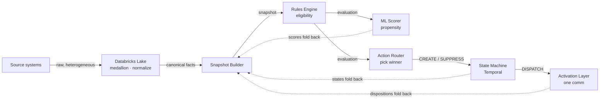

# 00 · Overview

## What the system is

NBA (Next-Best-Action) is a **real-time decisioning engine**. For every member it continuously answers one question — *"what is the single best thing to do for this person, on each channel, right now?"* — then does it, watches the result, and folds that result back in so the next answer is better.

It is built as a **streaming pipeline of small, single-purpose services** connected by Kafka topics, with a durable **Temporal state machine** holding the per-action lifecycle, a **Databricks medallion lake** as the data backbone and analytics store, and a **Command Center** for visualization and authoring.

The design goal is that the *entire* system is observable, every decision is *explainable*, every message is *replayable*, and the whole thing *recirculates* — outputs become inputs to the next decision.

## The core loop

The dotted edges are the **recirculation**: the ML scorer's scores, the state machine's states, and the activation layer's dispositions all re-enter as member facts, which produce a new snapshot, which produces a new evaluation. The loop is what makes the system *reactive* — a delivery confirmation or a goal conversion immediately changes the next decision.

Alongside this async outbound loop runs a **synchronous inbound hot path**: when a member shows up (an inbound call/visit), the action-library API serves a real-time decision off the facts they present. `GET /next-action` (with a `{facts}` body) merges those facts into the snapshot, re-evaluates eligibility, and scores — returning the per-channel action set right now; `POST /disposition` and `POST /completion` then record the outcome. The presented facts are optimistically written through to Redis and emitted to the bus (the snapshot-builder self-heals via event-time LWW), so the API is *just the hot path* — an accelerator over the same Kafka source of truth.

## Why each piece exists

| Need | Answer |
|------|--------|
| Source systems speak different dialects | The **medallion lake** normalizes any raw shape into one canonical fact vocabulary. |
| A decision needs *all* current facts at once | The **snapshot-builder** keeps a last-write-wins snapshot per member. |
| Eligibility rules change constantly, no redeploys | The **rules-engine** compiles authored JSON rules into Drools at runtime. |
| Rank the eligible options | The **ml-scorer** attaches a propensity score per ChannelAction. |
| Only one action should win a channel | The **action-router** picks the top-scored eligible action and suppresses the rest. |
| A send has a lifecycle (sent → delivered → engaged → converted) that must survive restarts | A **Temporal workflow** per ChannelAction holds the durable state machine. |
| A burst of facts must not fire two competing sends | The state machine **debounces** and resolves the sibling race itself. |
| Channels have daily/rate caps | A **throttle gate** in the state machine admits, queues, or reroutes. |
| Exactly one communication per action | The **activation layer** is the single send point; it classifies provider statuses into canonical dispositions. |
| Everything must be auditable & analyzable | The lake captures every fact, evaluation, activation, and snapshot into a medallion. |
| Humans need to see and steer it | The **Command Center** renders the live system and authors actions/rules. |

## Two completion concepts (important)

- **Soft completion** — the member *engaged* (opened, clicked, answered). Rule-based, computed fresh each evaluation from the delivery disposition against a per-channel "soft bar." Non-terminal; the action keeps watching for a hard completion.
- **Hard completion** — the member did the *goal* (booked, purchased, converted). Permanently latched. Terminal `HARD_COMPLETED`. The positive ML training label.

See [hard-soft-completion.md](hard-soft-completion.md).

## Identity model

- Externally a member is `entityType:entityId` (e.g. `OPERATOR:op-sg-0`).
- On first sight the snapshot-builder (or ml-scorer) mints an internal `nbaId` = `nba_` + 12 hex chars, stored in Redis `nba:idmap:{entityType}:{entityId}` with `SETNX` (first-writer-wins, permanent).
- **Snapshots and evaluations are keyed by `nbaId`. Facts are keyed by `entityType:entityId`.** The two are joined by the id-map. The raw `memberId` (= `entityId`) rides the whole activation path so downstream systems never reverse-map.

## A ChannelAction is the atom

The unit of everything below the rules engine is the **ChannelAction** — one (action, channel) pair for one member. It has:
- a Drools-evaluated `eligible` flag,
- an ml-scorer `score`,
- a live `workflowState` (one of 11),
- coarse `active` / `cancellable` / `softCompleted` / `hardCompleted` flags,
- exactly one Temporal workflow `nba-ca:{nbaId}:{actionId}:{channel}`.

Everything downstream — routing, the state machine, debounce, dispositions, analytics — operates per ChannelAction.

## What "real-time" means here

The system favors **eventual completion over short timeouts**. The pipeline is asynchronous end-to-end. A fact arriving produces a snapshot in milliseconds; the rules/score/route hops are sub-second on a warm pipeline; the state machine intentionally holds a **debounce window** (default 60s in prod) before sending so a burst settles into one decision. Outcomes (delivery, engagement, conversion) arrive minutes-to-days later and recirculate. Nothing is lost while waiting — the durable Temporal workflow and the compacted Kafka topics hold state.

## Glossary

| Term | Meaning |
|------|---------|
| **Fact** | One typed key/value about a member. `{key, value, valueType, eventTs, source}`. |
| **Canonical fact key** | The governed vocabulary, e.g. `operator.activity.daysSinceLogin`, `nba.score.*`, `nba.actionstate.*`. |
| **Snapshot** | The current last-write-wins map of a member's facts, keyed by `nbaId`. |
| **Evaluation** | The rules-engine output: `channelActions[]` + `milestones[]`, keyed by `nbaId`. |
| **ChannelAction** | One (action, channel) for one member — the decisioning atom. |
| **Activation / decision** | A router op (`CREATE`/`SUPPRESS`/…) or a state-machine op (`DISPATCH`/`CANCEL`). |
| **Disposition** | A channel outcome (raw provider status + canonical delivery state). |
| **Soft / hard completion** | Engagement vs goal conversion (see above). |
| **Debounce** | The window the state machine waits before sending, during which siblings dedup. |
| **Throttle gate** | The per-channel admission control (SEND / WAIT / SUPPRESS). |
| **Medallion** | Bronze→silver→gold lake layering. |
| **Outbox** | A Postgres table CDC-tailed by Debezium to publish Kafka messages transactionally. |
| **Inbound hot path** | The synchronous serve: `GET /next-action` (with facts) → `POST /disposition` → `POST /completion`, deciding in real time off the facts a member presents on arrival. |
| **nba-inbound-sim** | A local client that models real inbound members by driving the inbound hot-path APIs (serve → disposition → completion) on the action-library, so inbound completions flow the same proven path. |
