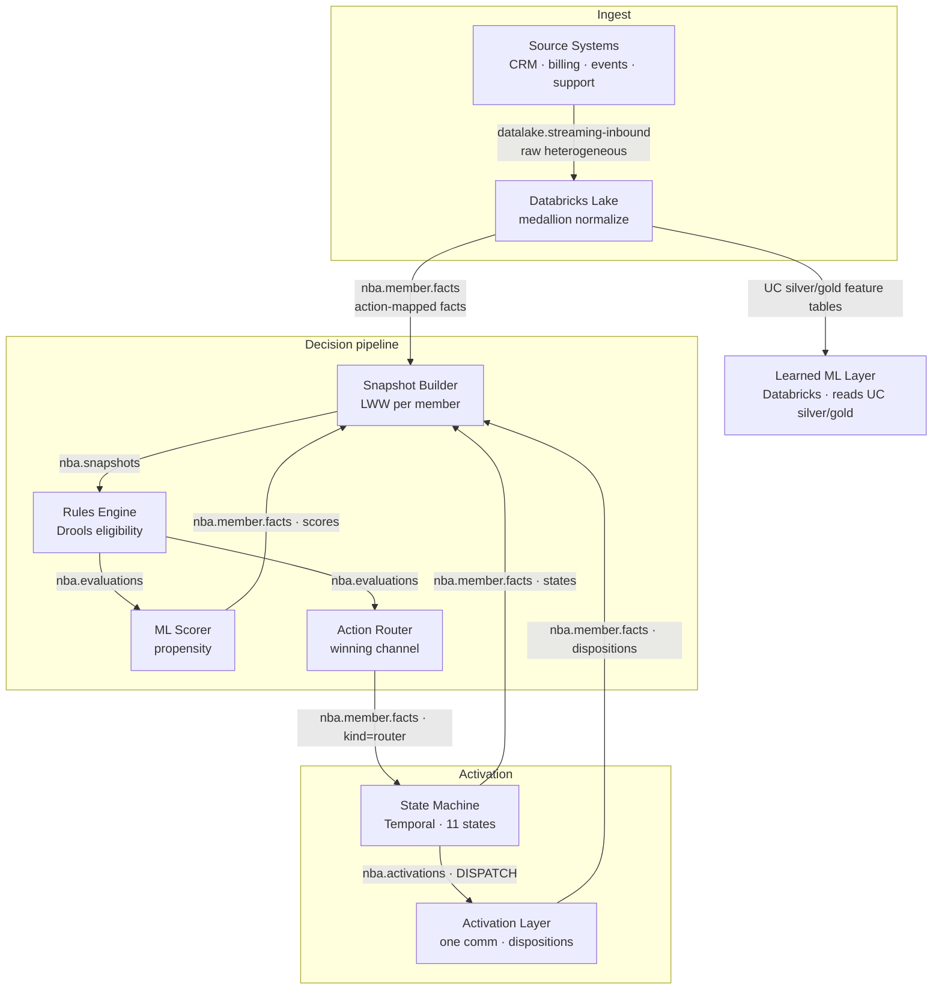

# 01 · Architecture

## Components at a glance

| Component | Tech | Consumes | Produces | Responsibility |
|-----------|------|----------|----------|----------------|
| **Source systems** | external | — | `datalake.streaming-inbound` | Stream raw, dialect-specific records (CRM, billing, product events, support). |
| **Databricks Lake** | PySpark / Delta | `datalake.streaming-inbound` (+ internal topics for analytics) | `nba.facts`, `nba.member.facts` | Medallion: normalize heterogeneous raw → canonical facts; analytics store; throttle/comms counts. |
| **Snapshot Builder** | Java 21 | `nba.member.facts` | `nba.snapshots`, `nba.facts` (firehose), `nba.definitions` | Last-write-wins per-member snapshot in Redis; re-emit on every change. |
| **Rules Engine** | Java 21 + Drools | `nba.snapshots`, `nba.definitions` | `nba.evaluations` | Compile authored rules → Drools at runtime; emit unified `channelActions[]` + the transient `newCompleted[]`/`newMilestones[]` transition arrays (the router publishes the durable facts off these — see below). |
| **ML Scorer** | Java 21 | `nba.evaluations`, `nba.facts` | `nba.member.facts` (`kind=score`) | Attach a propensity score per eligible ChannelAction. |
| **Action Router** | Java 21 | `nba.evaluations`, `nba.definitions` | `nba.member.facts` (`kind=router`/`completion`/`milestone`) | Pick the winning action per channel; suppress losers; bridge completions; **publish the durable completion/milestone facts** off the eval's transition arrays. |
| **State Machine** | Java 21 + Temporal | `nba.member.facts` (`kind=router`/`disposition`/`completion`), `nba.definitions` | `nba.activations`, `nba.member.facts` (`kind=state`) via outbox | One durable workflow per ChannelAction; debounce, throttle-gate, dispatch, track. |
| **Activation Layer** | Java 21 | `nba.activations` | `nba.member.facts` (`kind=disposition`) | Send exactly one comm; classify provider status into canonical dispositions. |
| **Action Library** | Java 21 + Javalin | `nba.definitions` | `nba.definitions`, `nba.member.facts` via outbox; `nba.member.facts` (`source=hotpath`) + `nba.activations` direct | Author actions/rules; suppression; channel config; **the synchronous inbound HOT PATH** (`GET /next-action` with facts, `POST /disposition`) — merge-eligible-score on demand, optimistic Redis write-through, gold-direct feature read. |
| **KIE Server** | Java 21 + Drools | `nba.definitions` | (HTTP) | Optional horizontal scale-out for Drools evaluation. |
| **Command Center** | Node BFF + React | all NBA topics (tail), Databricks, Action Library | (SSE/GraphQL) | Live system map, analytics, authoring, ops. |

## The data-flow loop (authoritative)

Read it as: **a fact enters → the snapshot updates → the rules re-evaluate → the score and the routing decision are made → the state machine runs the send → the outcome recirculates as new facts.** Scores, states, and dispositions are *also facts* on `nba.member.facts`, which is why they fold back into the snapshot and trigger the next evaluation.

### The lake is a *source*, not a sink

The lake **emits** facts into the pipeline (`nba.member.facts` = the action-mapped subset for the snapshot-builder; `nba.facts` = all facts, the firehose). For its own analytics it *also* tails the internal NBA topics into silver/gold tables, but those analytics "return trips" are deliberately **not** part of the decisioning loop and are not drawn on the live System Map — the lake is the front door for data, not a place the pipeline reports back to. The **learned ML layer** (the Databricks bundle in [`databricks/ml`](../databricks/ml/README.md)) reads its features from those Unity Catalog tables — `silver_snapshots` (point-in-time features per decision), `silver_activations` (what was launched), `gold_member_snapshot` (current features) — **not** from the `nba.facts` firehose, which has no decisioning subscriber today.

## The synchronous hot path (inbound)

The loop above is the **asynchronous flywheel** — facts recirculate, the router re-evaluates, the next serve reads the router's last cached eval. Bounded staleness, refreshed each flywheel cycle. Alongside it the Action Library runs a **synchronous hot path** for the inbound "pull": when a member shows up *now* with context, the API computes the decision on demand instead of waiting for the flywheel.

**`GET /next-action`** is the inbound serve. With an optional `{facts}` body it runs the hot path: merge the presented facts onto the member's `nba:snapshot` → recompute eligibility → score — so the returned NBAs reflect the just-given context (the inbound "call topic"). With no facts it serves from the cached eligibility eval (the router's last write). It returns **all** actions for the requested channel (not top-1), each stamped with a `state` (`eligible` | `active` | `completed`); `includeCompleted=true` surfaces the `completed[]` actions that otherwise prune out.

**Inbound tracking (the serve→disposition journey).** The serve stamps one `correlationId` on the served set and emits an `INBOUND_SERVE` event. **`POST /disposition`** accepts that `correlationId`, emits an `INBOUND_DISPOSITION` linked to it, then stamps a *new* `correlationId` on the next-served set and emits its `INBOUND_SERVE`. These are **direct-to-Kafka** tracking events on `nba.activations` (`op=INBOUND_SERVE`/`INBOUND_DISPOSITION`, `source=inbound`) — fire-and-forget, **no outbox / no distributed transaction** — so the whole serve→disposition journey is linkable in the lake and on the Command Center member timeline. (Outbound dispatches now also carry `nbaId`/`entityId` attribution on the single-action `emitActivation`, so outbound sends are countable too.)

### "The API is just the hot path" — optimistic write-through

On a real hot path (presented facts, or an inbound disposition) the API **warms Redis** so the very next read — even a no-facts serve — is fresh, without waiting for the bus to round-trip:

- LWW-merge the presented facts into `nba:snapshot:{nbaId}` (the `fact:` fields), and read-modify-write the `nba:eligibility:{nbaId}` channelAction **scores** — back-to-back, plain Jedis (**no Lua, no `MULTI`**).
- Emit the presented facts to `nba.member.facts` (member-fact shape, `source=hotpath`) as the **durable** path.

The snapshot-builder then re-applies those facts under event-time LWW as the **self-heal**: if the optimistic write loses a race or fails, the bus reconciles it. The write-through is **best-effort** (wrapped in try/catch) and never fails the decision.

This preserves the **single-writer model**: the snapshot's authoritative writer is still the snapshot-builder, eligibility's is still the action-router. The hot path's writes are best-effort and bus-reconciled — and because every writer stamps event-time and merges LWW, the writers are commutative. The API is *just an optimistic accelerator*; **Kafka + the snapshot-builder remain the source of truth.**

### Hot-path features: read straight from gold (no Redis cache)

The ~30 rich model features (`riskScore`, `comorbidityCount`, `rxAdherencePDC`, `openCareGaps`, the activity/clinical/profile block) live in gold (`{LAKE_NS}.gold_member_snapshot`). The hot path reads them **straight from gold via the serverless SQL warehouse** — `goldFeatures(entityId)`, `featureSource="gold"`, ~1s warm; the hot path *wears the latency*. The old `nba:features` Redis cache machinery (`warmFeatures`, the `/warm-features` prefetch endpoint, `FEATURE_TTL`) is **gone**. The Redis caches are now exactly **three**: **snapshot**, **eligibility**, and **action→fact** (catalog/rules). (`run.ps1` wires `NBA_DBX_WAREHOUSE` + `NBA_LAKE_NS`.)

The **intended** fast online store is **Lakebase** (managed Postgres, instance `nba-lakebase`, catalog `nba_pg`) fed by a *continuous* synced table from gold (`gold_member_snapshot` has `delta.enableChangeDataFeed=true`), read at ~ms by `lakebaseFeatures` (a point-read by `nbaId`). It is **BLOCKED**: the Databricks synced-table API accepts `scheduling_policy=CONTINUOUS` but the backing DLT pipeline fails in a retry loop with `UNITY_CATALOG_INITIALIZATION_FAILED` / "Metastore storage root URL does not exist" — this POC account's UC metastore has no storage root. The fix is an account admin setting the metastore storage root, then re-creating the synced table and flipping the hot path from `goldFeatures` back to `lakebaseFeatures` (left **dormant** in the Action Library for exactly this). The manual `load-lakebase.py` mirror (a triggered, not continuous, mirror) remains the Command Center BFF's source.

## Channels of communication (Kafka topics)

`nba.member.facts` is the **fact highway** — it carries external facts *and* six internal `kind`s distinguished by a Kafka `kind` header. Five are the recirculating decisioning facts — **router** decisions, workflow **state**s, **score**s, **disposition**s, **completion**s — and one is a routing signal: **throttle-suppress** (a hot per-channel throttle signal the snapshot-builder routes on to `nba.definitions`). It also carries the hot path's durable member-facts (`source=hotpath`, the presented-facts emission — see *The synchronous hot path* above). The other topics are single-purpose:

| Topic | Carries |
|-------|---------|
| `datalake.streaming-inbound` | Raw external source records (heterogeneous). |
| `nba.facts` | ALL normalized facts — the firehose. No decisioning subscriber today; the learned ML layer reads its features from UC silver/gold instead. |
| `nba.member.facts` | Action-mapped external facts + internal scores/states/dispositions/router decisions. |
| `nba.snapshots` | Per-member current-fact snapshots (keyed by `nbaId`). |
| `nba.evaluations` | Rules-engine `channelActions[]` + `milestones[]` + the transient `newCompleted[]`/`newMilestones[]` transition arrays (keyed by `nbaId`; the router strips the transients before persisting eligibility). |
| `nba.activations` | State-machine `DISPATCH`/`CANCEL` to the activation layer; **also** the direct-to-Kafka inbound tracking events (`op=INBOUND_SERVE`/`INBOUND_DISPOSITION`, `source=inbound`) that link a serve→disposition journey by `correlationId` (fire-and-forget, no outbox). |
| `nba.definitions` | Compacted broadcast of actions, rules, throttle levels, suppression. |

See [04-message-schemas.md](04-message-schemas.md) for the full catalog.

## Design principles

1. **Everything is a fact.** Scores, workflow states, and dispositions are facts on `nba.member.facts`. This is what makes recirculation uniform — there is no special back-channel; the next evaluation just sees new facts. The durable **completion**/**milestone** facts are computed by the rules engine (it emits per-eval `newCompleted[]`/`newMilestones[]` transition arrays — actions whose criterion just became true, milestone trees that just passed) but **published by the action-router** off those arrays — no diffing, no redundant eligibility-cache read; the router strips the transients before persisting the perpetual `completed[]`/`milestones[]` on `nba:eligibility:{nbaId}`.

2. **The state machine resolves races, not the router.** The router is a *blind bridge*: it can emit two `CREATE`s for the same member before the first round-trips. The Temporal state machine debounces and runs a sibling-dedup so exactly one send wins. (See [03-state-machine.md](03-state-machine.md).)

3. **No service produces to Kafka "by hand" where ordering with a DB write matters.** The Temporal worker and the Action Library write to a **Postgres transactional outbox**; Debezium CDC-tails it and publishes to Kafka. This makes "update the DB and emit the event" atomic. (See [09-infrastructure.md](09-infrastructure.md).)

4. **Rules are data, compiled at runtime.** There are **no `.drl` files** in the repo. The rules engine synthesizes Drools DRL from authored JSON condition trees on `nba.definitions` and rebuilds the `KieBase` on change. An operator edit in the Command Center is live within one Kafka round-trip.

5. **Exactly-once where it counts, idempotent everywhere else.** The snapshot-builder uses Kafka transactions (read-process-write EOS). Downstream, replays are made safe by **event-time last-write-wins** (a replayed old fact loses to a newer stored one) and **Temporal workflow-id dedup** (a repeated `CREATE` attaches to the running workflow).

6. **Lean by construction.** The snapshot only stores facts that some rule references (`nba:rulefacts`) plus the always-attach internal facts (`nba.score.*`, `nba.actionstate.*`, `nba.disposition.*`, `nba.completion.*`). The medallion only emits the action-mapped subset to `nba.member.facts`. The signal stays small.

7. **One communication per action.** The activation layer is the single send point. The router guarantees one winner per channel; the state machine guarantees one in-flight workflow per ChannelAction; the activation layer sends one comm and classifies the provider's raw status into a canonical disposition.

8. **Replay-safe timestamps.** Services that re-derive facts stamp the *decision time* (e.g. the ml-scorer stamps the eval's `evaluatedAt`, not wall-clock) so replays cannot overwrite newer state via LWW. (The side effect: you cannot measure those hops' processing latency from the fact timestamp.)

## Recirculation, concretely

A single conversion illustrates the loop:

1. A member books a meeting → the goal condition passes in the rules engine → `nba:completed:{nbaId}[actionId]` is latched (`HSETNX`, permanent).
2. The next evaluation carries `hardCompleted=true` on that ChannelAction.
3. The router bridges `HARD_COMPLETE` → the Temporal workflow moves to terminal `HARD_COMPLETED` and emits a state fact.
4. That state fact recirculates into the snapshot; the action's `active` flag goes false; `autoExcludeOnCompletion` drops it from eligibility.
5. The action stops being offered. The terminal `HARD_COMPLETED` is the durable, positive ML label.

## Why Temporal

A communication has a lifecycle that spans seconds (dispatch) to days (conversion), must survive process restarts, must not double-send under bursty input, and must time out cleanly if nothing converts. A durable workflow engine models this precisely: each ChannelAction is one workflow `nba-ca:{nbaId}:{actionId}:{channel}` whose event history *is* the state. Restarts replay the history; the debounce window, the throttle gate, and the disposition watch are all just `Workflow.await(...)` calls. The TTL is a deadline; expiry is `EXPIRED` (the negative ML label).

## Identity & keying

- A member is externally `entityType:entityId`, internally `nbaId` (`nba_` + 12 hex, minted via Redis `SETNX`).
- **Facts** are keyed on Kafka by `entityType:entityId` → a member's facts co-locate on one partition.
- **Snapshots and evaluations** are keyed by `nbaId`.
- **Router single decisions** are keyed `nbaId:actionId:channel`; **batch** decisions `nbaId:channel:batch`.
- **State-machine activations** are keyed `nbaId:actionId:channel:sm` (batch: `nbaId:channel:batch:sm`) — the `:sm` suffix prevents log-compaction from colliding the state machine's `DISPATCH`/`CANCEL` against the router's `CREATE`/`SUPPRESS`.

## Where to go next

- The full step-by-step with sequence diagrams: [02-process-flows.md](02-process-flows.md).
- The 11-state lifecycle and the debounce algorithm: [03-state-machine.md](03-state-machine.md).
- Every message on every topic: [04-message-schemas.md](04-message-schemas.md).
- Per-service internals, config, and failure modes: [06-component-specs.md](06-component-specs.md).
