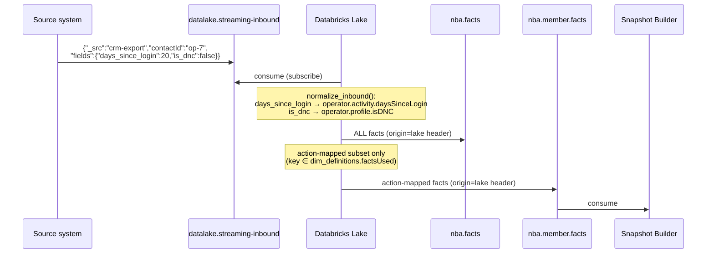
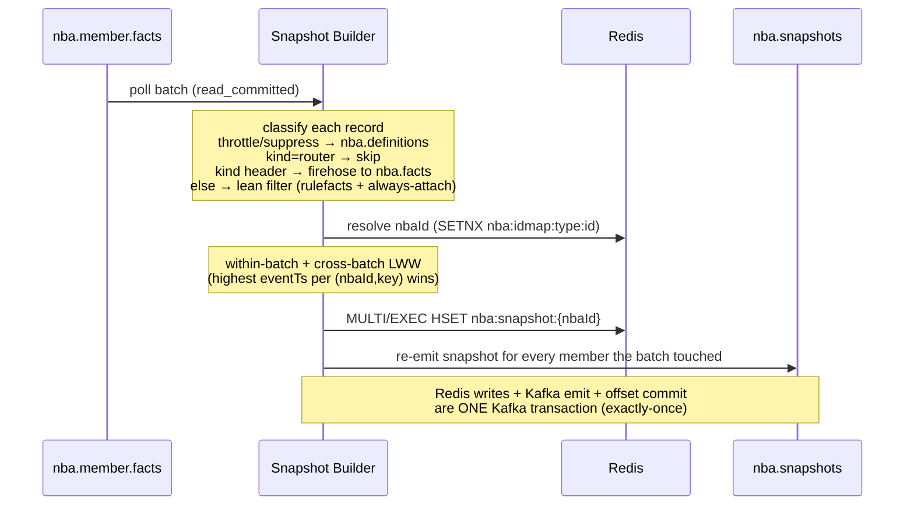
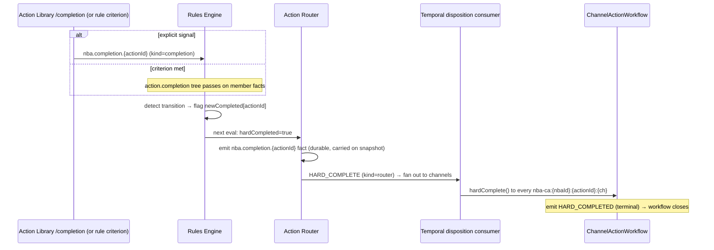
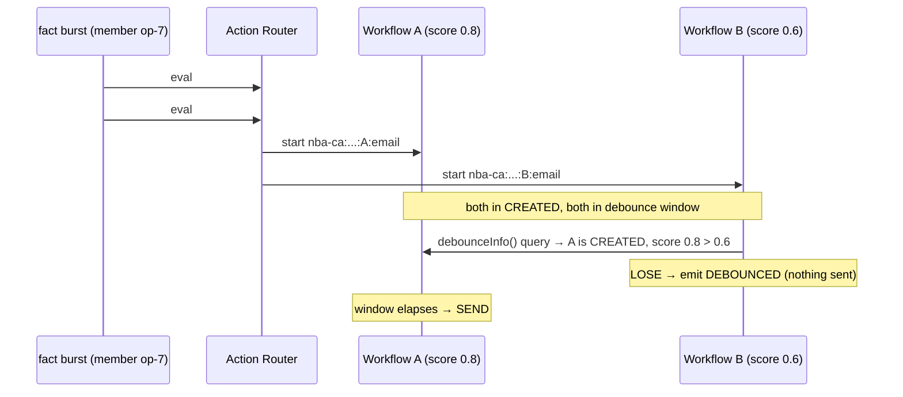
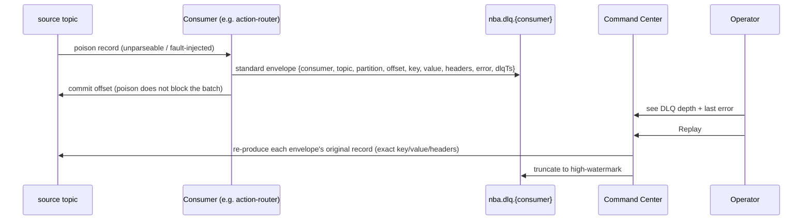

# 02 · Process Flows

End-to-end sequences. Every arrow is a real Kafka message, Redis op, or HTTP call. Topic names and `kind` headers are exact.

## Flow A — Ingestion & normalization (source → facts)

A source system emits a raw record in its own dialect. The medallion normalizes it into canonical facts and splits them two ways.



- **Heterogeneous in, canonical out.** Five shapes are recognized — four heterogeneous source dialects (CRM export, billing, product events, support ticket) plus an already-canonical passthrough (a source that already speaks the NBA `entityId`/`key`/`value` vocabulary); each maps to the governed vocabulary via `CRM_MAP` and the per-source branches in `normalize_inbound` (`nba_datalake_stream.py:129`). Unknown CRM fields fall back to `operator.activity.<camelCase>`.
- **The split.** *All* normalized facts → `nba.facts` (the firehose / ML-feature source). Only **action-mapped** facts (those some rule references) → `nba.member.facts` (the snapshot-builder's input). Non-rulefacts like `operator.plan` or `operator.csat` ride `nba.facts` only. (Cold-start exception: until any definitions are ingested, the lake has no `factsUsed` set yet and emits *all* facts to `nba.member.facts` so the pipeline still flows — see [08-data-and-lake.md](08-data-and-lake.md).)
- **Loop prevention.** Every lake emission carries an `origin=lake` Kafka header; the lake's own ingest drops `origin=lake` records before deserializing, so its analytics tail of `nba.member.facts` never re-ingests its own output.

> Locally, when Databricks is stopped, `nba/test/medallion_runner.py` mirrors `normalize_inbound` exactly and stands in for the lake; `nba/test/source_gen.py` produces the four heterogeneous shapes.

## Flow B — Snapshot assembly (fact → snapshot)



- The snapshot is the **last-write-wins** map of a member's facts. A fact older than what is stored is dropped (event-time LWW).
- The "lean filter" keeps only facts in `nba:rulefacts` plus the always-attach internal keys (`nba.score.*`, `nba.actionstate.*`, `nba.disposition.*`, `nba.completion.*`).
- The snapshot is re-emitted for **every** member the batch touched, even if a retry produced zero new Redis writes — this is what makes whole-batch retry idempotent.

## Flow C — Evaluation, scoring, routing (snapshot → decision)

```mermaid
sequenceDiagram
    participant SN as nba.snapshots
    participant RU as Rules Engine
    participant EV as nba.evaluations
    participant ML as ML Scorer
    participant MF as nba.member.facts
    participant RO as Action Router
    participant SM as State Machine (bridge)

    SN->>RU: consume snapshot
    Note over RU: fire Drools KieBase → eligible "actionId::channel"<br/>+ keep in-flight (ACTIVE_STATES) candidates<br/>+ latch milestones / hard-completion (HSETNX)
    RU->>EV: evaluation {channelActions[], milestones[]}<br/>header type=eligibility|score
    EV->>ML: consume (drop type=score by header)
    Note over ML: score eligible ChannelActions<br/>eventTs = eval.evaluatedAt (replay-safe)
    ML->>MF: nba.score.{action}.{channel} (kind=score)
    MF->>SN: (folds into snapshot → re-eval with scores)
    EV->>RO: consume (eligibility + score evals)
    Note over RO: pick winner per channel:<br/>hardCompleted→HARD_COMPLETE; softCompleted→SOFT_COMPLETE<br/>ineligible+cancellable→SUPPRESS; best free eligible→CREATE
    RO->>SM: CREATE / SUPPRESS (kind=router)
```

- The **score loop is broken by a header**: the rules engine tags score-only re-emits `type=score`; the scorer drops those at the header without deserializing. Without this, score → eval → score would spin forever.
- The router reads only the coarse flags the rules engine folded onto each ChannelAction (`eligible`, `active`, `cancellable`, `softCompleted`, `hardCompleted`, `score`). It never touches Temporal or Redis (except one `readMaxBatch`).
- The router holds a slot occupied by a *sent* action; it only supersedes an unsent (`cancellable`, state `CREATED`) action when a higher-scored candidate appears.

## Flow D — The send (decision → communication)

```mermaid
sequenceDiagram
    participant RO as Action Router
    participant BR as Temporal bridge
    participant WF as ChannelActionWorkflow
    participant TG as ThrottleGate
    participant OB as Outbox (Postgres)
    participant AC as nba.activations
    participant AL as Activation Layer
    participant MF as nba.member.facts

    RO->>BR: CREATE (kind=router)
    BR->>WF: start nba-ca:{nbaId}:{actionId}:{channel}<br/>(USE_EXISTING if running)
    Note over WF: emit CREATED → await debounce window (60s)<br/>sibling-dedup (LOSE/WAIT/PROCEED)
    WF->>TG: admit(channel)?
    alt SEND
        WF->>OB: emitActivation(DISPATCH) + emitState(IN_PROCESS)
        OB->>AC: DISPATCH (Debezium CDC)
        AC->>AL: consume
        Note over AL: send ONE comm; walk channel funnel
        AL->>MF: nba.disposition.* (kind=disposition)<br/>value=RAW status (the SM classifies)
    else WAIT
        Note over WF: re-await; backlog can drain before midnight
    else SUPPRESS (throttle)
        WF->>OB: emitState(SUPPRESSED, reason=throttle)
    end
```

- The state machine waits a **debounce window** before sending. During it, a `suppress()` (router superseding a not-yet-sent action) makes it `DEBOUNCED`; a sibling with a higher score makes it `DEBOUNCED` via the dedup. (Full algorithm in [03-state-machine.md](03-state-machine.md).)
- On `SEND`, the workflow writes `DISPATCH` and `IN_PROCESS` to the Postgres **outbox**; Debezium publishes `DISPATCH` to `nba.activations` and `IN_PROCESS` to `nba.member.facts`.
- The activation layer sends **one** comm and emits dispositions carrying ONLY `value` (the raw provider status). The rules engine reads the raw for soft-completion; the **state machine classifies raw → canonical itself** (`DispositionClassifier` — the sender never decides state).

## Flow E — Tracking the outcome (disposition → state → recirculation)

```mermaid
sequenceDiagram
    participant AL as Activation Layer
    participant MF as nba.member.facts
    participant DC as Temporal disposition consumer
    participant WF as ChannelActionWorkflow
    participant OB as Outbox
    participant SB as Snapshot Builder
    participant RU as Rules Engine

    AL->>MF: nba.disposition.* (kind=disposition, trackingId)
    MF->>DC: consume (filter kind=disposition)
    DC->>WF: disposition(state, corr) via trackingId
    Note over WF: corr-gated; emit PRESENTED / DECLINED / FAILED
    WF->>OB: emitState(PRESENTED)
    OB->>MF: nba.actionstate.{action}.{channel} (kind=state)
    MF->>SB: consume (always-attach) → snapshot
    SB->>RU: nba.snapshots → re-evaluate
    Note over RU: disposition vs channel soft bar → softCompleted=true?<br/>goal condition → hardCompleted latched
    RU->>RU: next eval carries soft/hard flags → router bridges
```

- The disposition's `trackingId` (`{workflowId}|{correlationId}`) routes it directly to the waiting workflow — no lookup. A correlation mismatch (stale disposition from a reused workflow id) is dropped.
- The workflow stays alive in `PRESENTED`/`SOFT_COMPLETED`/`DECLINED` watching for `HARD_COMPLETED` until its TTL. If the TTL elapses first → `EXPIRED` (negative ML label), and the slot frees for re-eligibility.

## Flow F — Hard completion (goal → terminal)



- Hard completion is **channel-agnostic**: the goal (e.g. "meeting booked") is tracked at the action level and fanned out to every channel workflow for that action via `ACTION_CHANNELS`.
- Permanence comes from the durable `nba.completion.{actionId}` fact the **action-router** publishes (carried perpetually on the snapshot), not from an `HSETNX` latch — the goal can only ever *trigger* the completion, never revoke it.
- The durable per-eval completion/milestone facts are published by the **action-router**, not the rules engine: the rules engine folds `newCompleted[]` (criterion just true: `byCriterion && !already-signalled`) and `newMilestones[]` (tree just passed: `treePass && fact-absent`) onto the eval; the router publishes `nba.completion.{actionId}` / `nba.milestone.{id}` from those arrays and strips them before persisting the single `nba:eligibility:{nbaId}` (the perpetual `completed[]`/`milestones[]` stay). No diffing, no redundant eligibility-cache read.

## Flow G — Inbound pull serve, dispose, complete (no state machine)

For surfaces that *ask* "what should I show this member right now?" (a portal, an agent screen, an inbound caller), the Action Library serves from Redis directly — no send. The top **eligible** served action now also starts the **standard journey workflow** (a `preDispatched` router CREATE — skips debounce/throttle/dispatch, straight to `IN_PROCESS` + disposition tracking + the standard TTL → `EXPIRED`; see [inbound-state-machine.md](inbound-state-machine.md)), with `IN_PROCESS` optimistically hot-patched into the Redis snapshot so the UI reads it instantly. The serve → disposition → completion journey is stitched together by a `correlationId` (dispositions route to the workflow via `trackingId`) and tracked DIRECT-to-Kafka so it is linkable in the lake and the Command Center member timeline.

```mermaid
sequenceDiagram
    participant UI as Inbound surface
    participant AL as Action Library :7001
    participant R as Redis
    participant GOLD as gold (SQL warehouse)
    participant MF as nba.member.facts
    participant AC as nba.activations
    participant SB as Snapshot Builder

    UI->>AL: GET /next-action/{entityId}?channel=email[&includeCompleted=true]<br/>(optional body {facts} = the "call topic")
    AL->>R: nba:idmap → nbaId
    alt facts presented — HOT PATH
        AL->>GOLD: goldFeatures(entityId) (~30 features, ~1s warm)
        Note over AL: merge nba:snapshot + presented facts → eligibility → score (dbx/local)
        AL->>R: OPTIMISTIC WRITE-THROUGH (best-effort, try/catch):<br/>LWW-merge facts into nba:snapshot:{nbaId}<br/>+ RMW refresh nba:eligibility:{nbaId} scores
        AL->>MF: emit presented facts (member-fact, source=hotpath) — DURABLE
        MF->>SB: re-apply facts (event-time LWW) → SELF-HEAL
    else no facts — CACHED
        AL->>R: GET nba:eligibility:{nbaId} (router's last eval)
    end
    Note over AL: ALL actions for the channel (n=ALL default),<br/>each stamped state ∈ {eligible, active, completed};<br/>completed[] pruned unless includeCompleted=true
    AL->>R: stamp correlationId on the served set
    AL->>AC: INBOUND_SERVE (op, source=inbound) — fire-and-forget tracking
    AL->>UI: actions {actionId, channel, name, contentKey, score, state}, correlationId

    UI->>AL: POST /disposition {entityId, actionId, channel, status, correlationId}
    AL->>AC: INBOUND_DISPOSITION (linked to correlationId) — tracking
    AL->>MF: nba.disposition.* (outbox path) — same as outbound
    AL->>R: stamp NEW correlationId on the re-served set + INBOUND_SERVE

    UI->>AL: POST /completion {entityId, actionId}
    AL->>MF: nba.completion.{actionId} (kind=completion) → hard-completion latch
```

This is a **pull**, not a push: it reads (or, on the hot path, recomputes) eligibility and returns the best actions. A served action's disposition is recorded the same way as an outbound one, so the funnel and the rules engine see it identically.

- **The hot path ("the API is just the hot path").** A facts-presented serve (an inbound "call topic") — or an inbound disposition — runs the synchronous merge-snapshot + score path so the returned NBAs reflect the just-given context. It then performs an **optimistic write-through** so the very next read (even a no-facts serve) is fresh: it LWW-merges the presented facts into `nba:snapshot:{nbaId}` and read-modify-writes the `nba:eligibility:{nbaId}` scores (back-to-back plain Jedis — no Lua, no MULTI), and emits the facts to `nba.member.facts` (`source=hotpath`) as the **durable** path. The snapshot-builder re-applies those facts (event-time LWW) as the **self-heal**: if the optimistic write loses a race or fails, the bus reconciles it. All best-effort (try/catch) — it never fails the decision. The single-writer model holds — the snapshot's authoritative writer is still the snapshot-builder, eligibility's is the action-router; event-time LWW makes the writers commutative. A no-facts serve reads the cached eligibility (bounded staleness, refreshed each flywheel cycle).
- **Features read straight from gold.** The hot path's ~30 rich model features (riskScore, comorbidityCount, rxAdherencePDC, openCareGaps, the activity/clinical/profile block) are read straight from `{LAKE_NS}.gold_member_snapshot` via the SQL warehouse (`goldFeatures`, `featureSource="gold"`, ~1s warm) — there is **no** Redis feature cache (the old `nba:features` machinery is gone; the three Redis caches are snapshot, eligibility, action→fact). The Lakebase point-read (`lakebaseFeatures`, ~ms) is the dormant ideal, blocked on the UC metastore storage root — see [08-data-and-lake.md](08-data-and-lake.md).
- **Inbound tracking (the serve→disposition journey).** The serve stamps a `correlationId` and emits `INBOUND_SERVE`; `POST /disposition` accepts that correlationId, emits an `INBOUND_DISPOSITION` linked to it, then stamps a NEW correlationId on the next-served set and emits its `INBOUND_SERVE`. These are DIRECT-to-Kafka events on `nba.activations` (`op = INBOUND_SERVE | INBOUND_DISPOSITION`, `source=inbound`) — fire-and-forget, no outbox / no distributed transaction. (Outbound dispatches now also carry `nbaId`/`entityId` attribution, so outbound sends are countable too.)
- **Completion emission.** `POST /completion` publishes the durable `nba.completion.{actionId}` fact that latches hard completion (Flow F). Per-eval completion/milestone facts (`nba.completion.{actionId}` / `nba.milestone.{id}`) are now emitted by the **action-router** off the eval's `newCompleted[]` / `newMilestones[]` transition arrays — the router strips those transient arrays before persisting the single `nba:eligibility:{nbaId}` object (the perpetual `completed[]`/`milestones[]` stay) — moved off the rules engine to save a redundant Redis read.

> A **real inbound member is an external client**, and the local `nba-inbound-sim` (image `localhost/ais-nba-inbound-sim`, on `aiservices_default`) models one: it reads warm members (a current `SOFT_COMPLETED` actionstate in their live `nba:snapshot`) from nba-redis and drives the REAL inbound APIs above — serve (`GET /next-action`) → disposition (`POST /disposition`) → completion (`POST /completion`) — instead of the old shortcut that wrote a completion fact straight onto the bus. Completions therefore flow the same proven path every inbound disposition does (outbox → `nba.member.facts` → snapshot-builder + datalake), so the lake carries "soft-complete → inbound completion" and the model learns to surface that action inbound. Warmth is a *lift*, not a gate: a cold baseline of non-warm members shows up too, some visits carry a "call topic" (facts → the serve hot-paths) while the rest serve cached. The Databricks source-sim now models OUTBOUND response only — its direct-fact inbound shortcut (`generate_inbound`) is removed.

## Flow H — Burst / debounce (why two facts don't double-send)



The router emitted two competing sends; the **state machine** — not the router — resolves it. The lower-scored sibling loses the dedup and becomes `DEBOUNCED` without ever sending. See [03-state-machine.md](03-state-machine.md#debounce-dedup) for the full tristate matrix and the `SUPPRESSING→WAIT` interlock.

## Flow I — Failure & replay (DLQ)



Replay is safe because every downstream consumer is idempotent: event-time LWW (snapshot, feature store), eval-hash dedup (router), workflow-id dedup (Temporal), walk-tracking (activation layer). The `NBA_FAULT_INJECT` env var on any consumer turns a chosen substring into a thrown exception, exercising the DLQ path on demand.

---

For the precise message shapes referenced above, see [04-message-schemas.md](04-message-schemas.md). For per-service internals, see [06-component-specs.md](06-component-specs.md).
