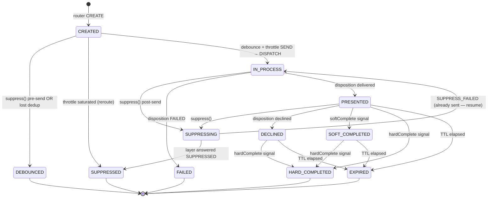

# 03 · The State Machine

Each ChannelAction — one (member, action, channel) — runs exactly one durable **Temporal workflow** `nba-ca:{nbaId}:{actionId}:{channel}`. The workflow *is* the state machine. Its event history is the durable record; a worker restart replays it.

Source: `nba/services/nba-temporal/src/main/java/ai/das/nba/temporal/` — `ChannelActionWorkflowImpl.java`, `ActionActivitiesImpl.java`, `NbaTemporalWorker.java`, `ThrottleGate.java`, `BatchOrchestratorWorkflowImpl.java`.

> **Flink alternative.** [`nba/services/nba-flink-engine/.../StateMachineFn.java`](../services/nba-flink-engine/src/main/java/ai/das/nba/flink/StateMachineFn.java) is a feature-complete replacement for the Temporal `ChannelActionWorkflow` — the same canonical states and throttle gate, with the member-keyed debounce/dedup pushed upstream into `MemberDedupFn` (a member-keyed pre-stage). The Temporal path and the Flink path are **mutually exclusive**: a deployment runs one or the other, never both.

## The 11 canonical states

| State | Meaning | Terminal? |
|-------|---------|:---:|
| `CREATED` | Workflow started; in the debounce window. Nothing sent yet. | |
| `IN_PROCESS` | `DISPATCH` emitted to the activation layer; provider not yet confirmed. | |
| `PRESENTED` | Activation layer reported delivery (provider-confirmed). Stays alive watching for completion. | |
| `SOFT_COMPLETED` | Rules engine bridged engagement (open/click/answer). Still watching for hard completion. | |
| `HARD_COMPLETED` | Goal converted. **Positive ML label.** Frees the slot. | ✅ |
| `DECLINED` | Member explicitly opted out (unsubscribe / STOP). Non-terminal — a rule may still hard-complete. | |
| `SUPPRESSING` | A `suppress()` arrived *after* dispatch; `CANCEL` emitted; awaiting the layer's verdict. | |
| `FAILED` | Send-side failure: bounce, compliance rejection, throttled-at-sender. | ✅ |
| `EXPIRED` | TTL elapsed with no hard completion. **Negative ML label.** Frees the slot; re-eligible. | ✅ |
| `SUPPRESSED` | Cancel honored mid-flight, **or** channel saturated for the day (throttle reason → reroute). | ✅ |
| `DEBOUNCED` | Lost the sibling-dedup race, or superseded by the router *before* anything was sent. | ✅ |

**Terminal set** = `{FAILED, SUPPRESSED, HARD_COMPLETED, EXPIRED, DEBOUNCED}`. `ChannelActionWorkflowImpl.java:33` defines `TERMINAL = {FAILED, SUPPRESSED, HARD_COMPLETED, EXPIRED}` for the disposition gate; `DEBOUNCED` is also terminal but handled by early-`return` before that gate.

**SUPPRESSED vs DEBOUNCED** — both end the workflow, but `DEBOUNCED` means *nothing was dispatched* (no `CANCEL` needed), while `SUPPRESSED` means an in-flight send was cancelled or the throttle declared the channel saturated.

**FAILED** comes *only* from the activation layer (a disposition), never from the state machine's own logic.

## The lifecycle



`PRESENTED`, `SOFT_COMPLETED`, and `DECLINED` are **holding states** — the workflow stays alive watching for `HARD_COMPLETED` until the TTL deadline.

## Workflow internals

### Entry — `activate(act, debounceSeconds)`

1. Store `myCorr = act.correlationId`, `myScore = act.score` (used by the debounce query).
2. `emit(CREATED)`.
3. `Workflow.await(debounceSeconds, () -> suppressRequested)` — the debounce window.
4. If `suppressRequested` fired → `emit(DEBOUNCED)` → return.
5. **Sibling-dedup loop** (below).
6. **Throttle-gate loop** (below).
7. On `SEND`: `emitActivation(DISPATCH)` + `emit(IN_PROCESS)` → `trackDispositions()`. The DISPATCH also resolves the per-channel touch template (the `channel_touch` counter — see [Per-channel touch-template escalation](#per-channel-touch-template-escalation-at-dispatch-only)); because it happens here, only an actually-sent attempt escalates the touch number.

### Signals & query

| Signal | Effect |
|--------|--------|
| `suppress()` | Sets `suppressRequested`. Wakes the debounce await or the disposition loop. |
| `disposition(status, corr)` | **Correlation-gated**: dropped if `corr != myCorr` (stale). Else enqueued. |
| `softComplete(corr)` | Sets `softCompleted` (not corr-gated; idempotent via `emittedSoft`). |
| `hardComplete(corr)` | Sets `hardCompleted` (not corr-gated). |
| **query** `debounceInfo()` | Returns `"{currentState}|{myScore}"` — strongly consistent, read live by siblings. |

`emit(s)` / `emitReason(s, reason)` set `currentState` *before* the activity, so `debounceInfo()` always returns the latest state.

### Disposition watch — `trackDispositions(act)`

A loop bounded by `deadline = now + ttlSeconds`. Each turn `Workflow.await(remaining, …)` blocks until a disposition is queued or a completion/suppress signal fires. Priority inside the loop:

1. `hardCompleted` → `emit(HARD_COMPLETED)` → return.
2. `suppressRequested && !cancelSent` → `emit(SUPPRESSING)` + `emitActivation(CANCEL)` → continue.
3. disposition queued → poll, `emit(state)`, return if terminal.
4. `softCompleted && !emittedSoft` → `emit(SOFT_COMPLETED)` (non-terminal, loop continues).

The TTL check is **guarded**: it only fires `EXPIRED` if the deadline passed *and* no disposition/signal is pending — so a disposition and the TTL arriving together never lose the disposition.

## Debounce dedup

The router is a blind bridge — a fact burst can `CREATE` two competing ChannelActions for one member before the first round-trips, so multiple workflows can sit in `CREATED` at once. The **state machine** resolves who sends.

After the debounce window, the workflow runs up to `DEBOUNCE_MAX_RECHECKS = 4` rounds of `activities.debounceLost(act)`. The activity lists running siblings via Temporal visibility and queries each one's live state:

```
query: WorkflowId STARTS_WITH 'nba-ca:{nbaId}:' AND ExecutionStatus='Running'
```

### The tristate matrix

For each running sibling (by its live `debounceInfo()` → `state|score`):

| Sibling state | Verdict | Why |
|---------------|---------|-----|
| `PRESENTED` | **LOSE** (now) | A touch already reached the member — stand down. |
| `DECLINED` | **LOSE** (now) | A touch reached the member (declined still = delivered). |
| `CREATED` and (`sibScore > myScore`, or equal score and `sibId < myId`) | **LOSE** (now) | Both racing in the window; highest score wins, lexicographic workflow-id breaks ties. |
| `CREATED` and I win the score/tiebreak | ignore | I'm ahead of this one. |
| `IN_PROCESS` | **WAIT** | Dispatched but unconfirmed — recheck. |
| `SUPPRESSING` | **WAIT** | A cancel is in-flight — it may fail and resume. |
| `SOFT_COMPLETED` | proceed | Engagement is **non-blocking** — a green light, not a dedup blocker. |
| terminal | n/a | Terminal workflows are not `Running`, so never returned. |

`WAIT_ON = {IN_PROCESS, SUPPRESSING}`. Aggregate result: any sibling `WAIT` → `WAIT` (re-await and recheck, bounded by 4); a `LOSE` returns immediately; otherwise `PROCEED`.

Workflow side:
- `LOSE` → `emit(DEBOUNCED)` → return.
- `WAIT` → `Workflow.await(debounceSeconds, …)` then recheck.
- `PROCEED` → continue to the throttle gate.

### The SUPPRESSING → WAIT interlock

This is the elegant part. Suppose a higher-scored action C arrives 58s into the debounce of a sending action A. A router `SUPPRESS` for A also arrives. A goes `SUPPRESSING` (it already dispatched). C, in its dedup, sees A in `SUPPRESSING` → `WAIT`. Two outcomes:
- The activation layer honors the cancel → A → `SUPPRESSED` (terminal) → C's next recheck sees no sibling → `PROCEED` → C sends.
- The cancel loses the race (A already delivered) → A resumes to `IN_PROCESS`/`PRESENTED` → C's recheck → `WAIT`/`LOSE` → C stands down.

So a higher score arriving late doesn't blindly preempt a delivered touch — it *waits on the suppression's outcome*. If the suppression succeeds, the replacement proceeds; if the original already landed, the replacement defers.

### Eventual-consistency caveat

Temporal **visibility** (which siblings are discovered) is eventually consistent (~1–2s). At the prod 60s debounce window this lag is immaterial. The per-sibling `debounceInfo()` **query** is strongly consistent. If the visibility query throws, `debounceLost` returns `PROCEED` (fail-open) — the re-evaluation loop catches any rare duplicate.

## Throttle gate

After dedup, `ThrottleGate.admit(channel)` returns one of:
- **SEND** — a token is available (effective rate < the channel's `rate` cap). Reserve and dispatch.
- **WAIT** — the rate window is full but the backlog can still drain before midnight. Re-await.
- **SUPPRESS** — the rate window is full *and* the backlog exceeds the day's remaining capacity. Emit `SUPPRESSED` with `reason=throttle` → the snapshot-builder routes it to `nba.definitions` as a channel-hot signal → the rules engine reroutes to another channel.

The effective rate is `max(lake's known rate level, this worker's in-window inflight)` — so external sends counted by the lake fold into the local gate. There is one authored cap per channel (`nba.throttle.{channel}.rate < N`); the daily ceiling is emergent (`rateCap × windows-per-day`).

## Emission via the outbox

The workflow **never produces to Kafka directly**. `emitState` and `emitActivation` INSERT into Postgres outbox tables (`outbox_member_facts`, `outbox_activations`); Debezium CDC-tails them and publishes:
- state facts → `nba.member.facts`, key `entityType:entityId`, fact key `nba.actionstate.{action}.{channel}`, `kind=state` (or `throttle-suppress` when `reason=throttle`).
- activations → `nba.activations`, key `nbaId:actionId:channel:sm`, `op=DISPATCH|CANCEL`, carrying `trackingId = nba-ca:{slug}|{correlationId}` and `memberId` (the activation layer sends to the *member*, never the nbaId).

### Per-channel touch-template escalation (at DISPATCH only)

The send activity resolves the per-channel **touch template** at the single DISPATCH point — `emitActivation` (single) / `emitBatchDispatch` (batch), *after* debounce/suppress/throttle have settled, so a debounced/suppressed/throttled attempt **never** escalates the touch number. A channel in the catalog `channels[]` may carry `touchKeys = [firstTouch, secondTouch, thirdTouch]`. A monotonic per-(member, channel) counter — table `channel_touch (nba_id, channel, n)` in the actionlib Postgres, created by the worker on startup — is bumped at dispatch via an atomic `INSERT ... ON CONFLICT ... RETURNING n` (race-free for concurrent batch sends) and **never resets**. The count is per-CHANNEL regardless of action: any prior send on that channel (of *any* action) counts toward the next action's touch number — which is why the counter lives in the send activity, not a per-(member, action, channel) workflow. The template is `touchKeys[min(n, len) - 1]` (caps at the last); absent `touchKeys`, the variant-selected `contentKey` is used unchanged. This does **not** add or change any state — escalation is purely a content choice resolved as the `DISPATCH` is written.

## Batch orchestration

When the router emits `CREATE_BATCH` (channel `maxBatch > 1`), a `BatchOrchestratorWorkflow` (`nba-batch:{nbaId}:{channel}`) settles the top-N (restarting its window on each `updateBatch` so the latest top-N wins), then starts one **pre-dispatched** child `ChannelActionWorkflow` per action and emits a single batch `DISPATCH` carrying all actions. Pre-dispatched children skip the debounce/throttle/dispatch path and go straight to `trackDispositions()`; each gets its own `trackingId` so per-action dispositions route individually.

## Determinism

Temporal requires deterministic workflow code — the event history must replay identically. **Changing `ChannelActionWorkflowImpl` branching logic requires draining in-flight runs before deploy** (or introducing `Workflow.getVersion()` gates, not yet present). Activities (`ActionActivitiesImpl`) have no such constraint and can change freely.

## Configuration

| Env | Default | Purpose |
|-----|---------|---------|
| `NBA_TEMPORAL` | `nba-temporal:7233` | Temporal service. |
| `NBA_DEBOUNCE_SECONDS` | `60` | Debounce window. |
| `NBA_TASK_QUEUE` | `nba-channel-actions` | Worker task queue. |
| `NBA_PG_HOST`/`DB`/`USER`/`PASSWORD` | `ais-nba-postgres`/`actionlib`/`nba`/`nba` | Outbox DB. |
| `NBA_MEMBER_FACTS` / `NBA_ACT_TOPIC` / `NBA_DEFINITIONS_TOPIC` | `nba.member.facts` / `nba.activations` / `nba.definitions` | Topics. |
| `NBA_DISP_DLQ` / `NBA_BRIDGE_DLQ` | `nba.dlq.temporal-disposition` / `nba.dlq.temporal-bridge` | DLQs. |
| `NBA_BRIDGE_CONCURRENCY` | `1` | Parallelism of the workflow-start path (see below). |
| `NBA_FAULT_INJECT` | `""` | Test hook. |

### Custom search attributes (Temporal)

The ChannelAction workflows set two custom search attributes at start — **`NbaActionId`** and **`NbaChannel`** (both `Keyword`). The namespace **must have both registered before workers start**: `infra/run-nba-temporal.ps1` does this idempotently on boot. A missing one makes **every** `WorkflowClient.start` fail `INVALID_ARGUMENT` ("search attribute not defined") — which silently DLQs the whole activation layer (the bridge keeps failing to start workflows). 

The start path itself is serial by default; **`NBA_BRIDGE_CONCURRENCY`** (default `1`) fans the per-record starts across a pool — the measured **~12/s serial → ~180/s** (starts are idempotent: deterministic workflowId + USE_EXISTING conflict policy, batch awaited before commit). See [../PERFORMANCE.md](../PERFORMANCE.md).
