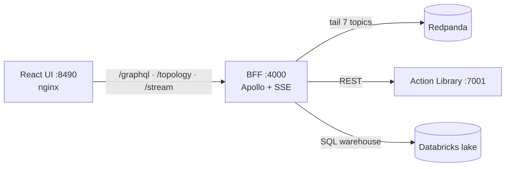
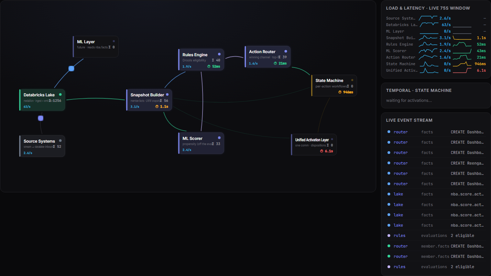
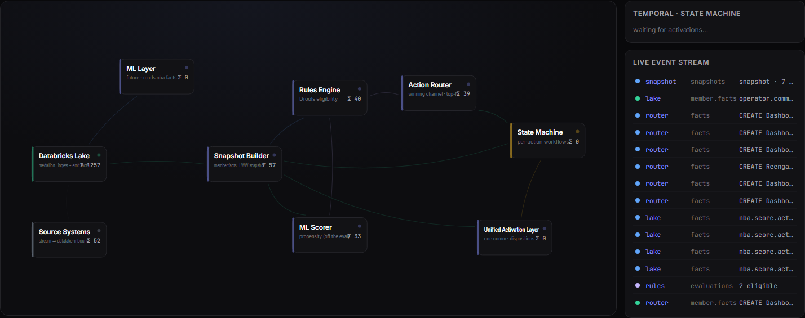
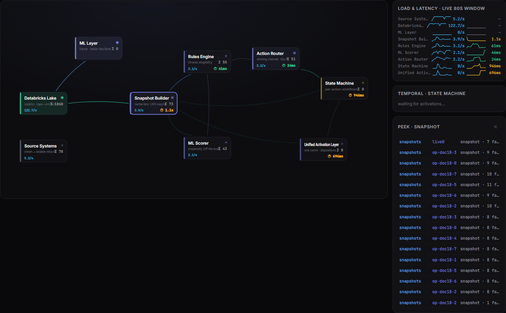
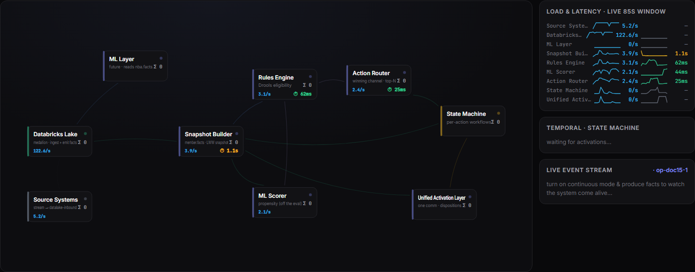
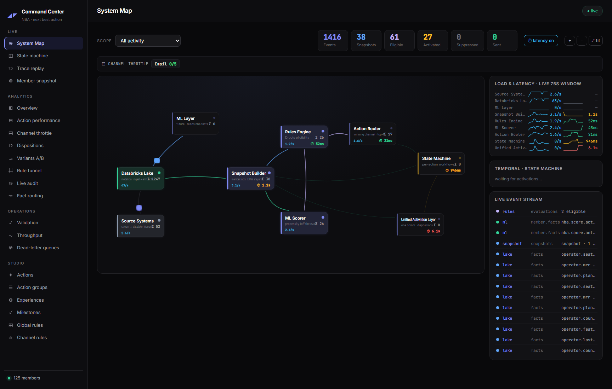

# 07 · Command Center

The Command Center is the operator surface: a live picture of the entire NBA system, full analytics, decision replay, and authoring. It is a **Node BFF** (`ais-nba-bff:4000`) + a **React/Vite UI behind nginx** (`ais-nba-command-center:8490`).

> **Without the lake.** The System Map, State Machine, Trace Replay, and all Studio authoring run entirely on the live Kafka stream + the Action Library REST API — **no Databricks**. Only the Analytics and Ops (Validation/Throughput) tabs require the warehouse; they show "lake offline" when Databricks is stopped (as it is overnight). The screenshots below are all lake-independent views.

## The System Map (the centerpiece)

A live, animated picture of the whole pipeline. Nodes are components; edges are topic flows. The layout is a **recirculating loop**: ingest on the left, the forward decision→activation path arcs across the top, and the fold-backs (scores, states, dispositions) recirculate along the bottom into the snapshot.

**What's live on it:**
- **Packet animation.** Every Kafka event animates a packet along the edge it left. State transitions render as **labeled, state-colored boxes** sliding along the arc (the rest are dots colored by topic).
- **Processing latency in each box.** With the latency overlay on (default), each component shows its throughput (`N/s`) and its **processing latency** — the time from its upstream's emit to its own emit, color-graded green<250ms / amber<1.5s / red≥1.5s. (The ML scorer shows no latency — it stamps the eval's replay-safe timestamp, so its hop is meaningless.) Toggle off to see cumulative `Σ` counts instead:

  

- **Load & latency trend panel** (right). One row per node with dual sparklines — throughput (blue) and latency (color-graded) — over a rolling 5-minute window, fed from the BFF's metric history.
- **Temporal state-machine panel** (right). The most-recently-updated workflows as pip-tracks (CREATED → IN_PROCESS → PRESENTED → SOFT_COMPLETED) with terminal labels.
- **Channel-throttle strip.** Per-channel `sent/cap` chips, flagging `⛔ rerouting` when a daily ceiling is hit.
- **Stats strip.** Session totals: Events, Snapshots, Eligible, Activated, Suppressed, Sent.

**Interactions:**
- **Pan / zoom / fit.** Drag to pan, scroll to zoom (toward the cursor, gentle), `＋`/`－`/`⤢ fit` buttons. The viewBox auto-fits all nodes and the recirculation arcs.
- **Peek a node.** Click any component to inspect the last payloads flowing through it:

  

- **Scope to one journey.** Filter to a single member or action to watch just its path; all aggregates rescope:

  

### The full Command Center

Left: navigation (Live / Analytics / Operations / Studio). Center: the System Map. Right: the live trend panel, the Temporal panel, and the raw event stream.

## The BFF

Container `ais-nba-bff`, port 4000. Four surfaces:

### SSE `/stream`
Tails seven topics over native KafkaJS (with a registered **Snappy** codec) on an ephemeral consumer group `cc-live-systemmap-{ts}` (`fromBeginning:false` — live edge only). On connect it sends a `hello` frame (`{topology, stats, stateCounts, metrics}`) + backfills the last 40 events, then streams each Kafka event as `data:`. Every 2s it pushes a named `event: metrics` frame.

- **`emitterFor(topic, source, kind)`** attributes each event to the node that emitted it (router by `kind=router`; `nba.facts`→lake; `nba.member.facts` by `source`; unattributed member.facts→lake).
- **`canonEntity`** resolves correlation to `entityId` (evals carry only `nbaId`, resolved via the snapshot's nbaId↔entityId pairing) — this is what makes the eval hop light up.
- **`recordMetric`** keeps 30s of per-edge hop latencies (`ev.ts − upstream emit ts` for the same entity) and per-node throughput; `metricHistory` is a 60-point/5s ring (5-minute window).
- **`stateCounts`** is an in-memory rollup of the current state of every (member, action, channel) from `nba.actionstate.*` facts, against the 11 `CANONICAL_STATES`.

### `/topology`, `/recent/:node`, `/livestats`
The system-map node/edge graph; the last 25 events per node; live stats.

### `/graphql` (Apollo)
~30 queries and ~18 mutations. Authoring queries (actions, rules, milestones, groups, experiences) hit the Action Library REST (falling back to the lake's `dim_definitions` if it's down). Analytics queries (`funnel`, `actionPerformance`, `throttleStats`, `layerHealth`, `dispositionFunnels`, `variantPerformance`, `factLibrary`, `ruleFunnel`, `trace`, `memberSnapshot`, `scoreDistribution`, …) hit Databricks via an OAuth-M2M SQL-warehouse client with a small TTL cache. Mutations proxy to the Action Library (`upsertAction`, `suppressAction`, `setChannelMaxBatch`, …) or operate on Kafka (`replayDlq`, `flushDlq`).

### Databricks client
SP OAuth M2M token (cached), warehouse auto-discovery, statements polled to `SUCCEEDED`, TTL-cached responses. Namespace `workspace.nba_poc`. **This is the only thing that warms the warehouse — stopping the BFF lets Databricks idle to zero cost.**

## UI tabs

A single React SPA; a `usePoll` hook drives live data; a `live` toggle pauses all polling.

### Live (lake-independent)
- **System Map** — above.
- **State Machine** — every workflow walking the 11 states; happy-path row + off-ramp row with live counts and glow-on-transition; live tracks; a categorized event feed (ROUTER / WORKFLOW / CHANNEL / GOAL).
- **Trace Replay** — pick a member → pick a decision (`correlationId`) → a 7-step replay (snapshot → eligibility (with per-condition pass/fail explanations) → propensity → routing → workflow → disposition → audited), with autoplay highlighting each node on the map.
- **Member Snapshot** — search a member; a chronological journey (milestones + activations + dispositions), a dot-path tree of every current fact, and the full NBA history per (action, channel).

### Analytics (lake-dependent)
Overview KPIs + funnel + dispositions donut + score histogram; Action Performance (with inline suppress/restore); Channel Throttle (token-bucket visual, daily bar, hourly sparkline, editable maxBatch); Dispositions funnels; Variants A/B (winner badge); Rule Funnel (interactive what-if member drop-off compiled to SQL); Live Audit; Fact Routing.

### Operations (lake-dependent)
- **Validation** — read-only invariant checks (lake reachable, throttle caps authored, eligibility/activations/snapshots producing, activations-within-eligibility, sends captured). Green "SYSTEM OPERATIONAL" / red "ATTENTION NEEDED".
- **Throughput** — per-layer health vs a 7-day same-hour baseline; flags degraded/quiet.
- **Dead-letter Queues** — per-consumer DLQ depth + last error; **Replay** (re-produce to source topic, then truncate) and **Flush** (truncate).

### Studio (authoring → Action Library, lake-independent)
- **Actions** — full editor: channels (with content templates, soft-completion override, A/B variants with %-split + targeting conditions), inclusion/exclusion trees, completion goal (+ auto-exclude, hard TTL). Fact inputs autocomplete from the lake's `factLibrary` (free text allowed).
- **Action Groups** — taxonomy tree (nestable). **Experiences** — flat journey labels. **Milestones / Global Rules / Channel Rules** — name + condition tree (channel rules typically encode throttle caps).

## Deploy

| Container | Image | Port | Build |
|-----------|-------|------|-------|
| `ais-nba-bff` | `node:20-alpine` | 4000 | `bff/run.ps1 -Build` |
| `ais-nba-command-center` | 2-stage (vite build → `nginx:alpine`) | 8490→80 | `ui/run.ps1 -Build` |

nginx proxies `POST /graphql`, `/topology`, `/recent`, `/livestats`, and `/stream` (HTTP/1.1, buffering off, 3600s read timeout) to `nba-bff:4000`; everything else is the SPA (`try_files … /index.html`). Topology/positions come from the BFF's `/topology` — changing the layout is a BFF-only rebuild; the UI reads it live.

The BFF reads Databricks creds from the gitignored `nba/databricks/databricks.env`; without them the analytics resolvers throw "Databricks lake not configured" and the lake-dependent tabs go dark — the rest is fully functional.
