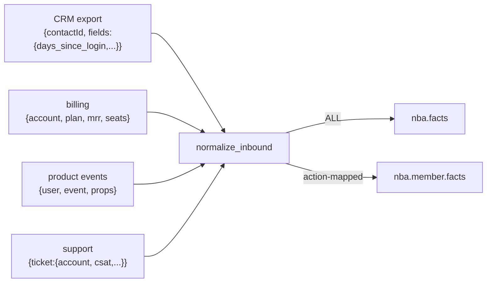
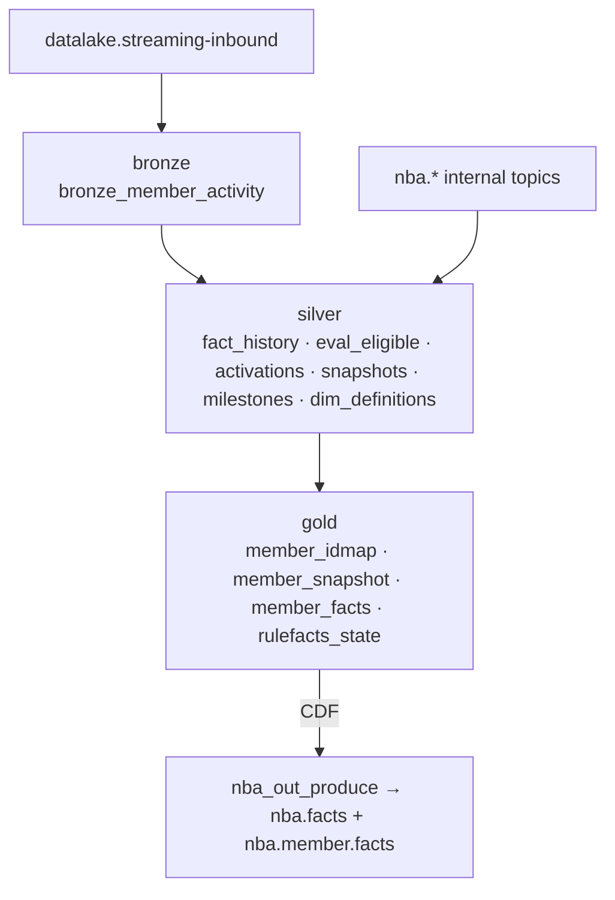

# 08 · Data & Medallion Lake

The Databricks lake is two things at once: the **front door for external data** (it normalizes raw source records into canonical facts and emits them into the pipeline) and the **analytics + audit store** (it captures every fact, evaluation, activation, and snapshot into a medallion). Source: `nba/databricks/`.

> Databricks is intentionally stopped overnight to keep cost at zero (`python nba/databricks/shutdown_minimal.py` re-idles it). Locally, `nba/test/medallion_runner.py` mirrors the normalization and stands in for the lake.

## Ingestion: heterogeneous raw → canonical facts

`nba_datalake_stream.py` is a Structured Streaming job. Its raw ingress is `datalake.streaming-inbound`, which carries dialect-specific records from four source systems. `normalize_inbound` (`nba_datalake_stream.py:123`) maps each into the governed vocabulary.

**The normalization map** (`CRM_MAP`, case/underscore-insensitive):

| Source field | Canonical key |
|--------------|---------------|
| `days_since_login` | `operator.activity.daysSinceLogin` |
| `completed_tasks` | `operator.activity.completedTasks` |
| `viewed_dashboard` | `operator.activity.viewedDashboard` |
| `used_chat` | `operator.activity.usedChat` |
| `is_dnc` | `operator.profile.isDNC` |
| `sms_consent` | `operator.profile.smsConsent` |
| `emails_this_week` | `operator.comms.emailsThisWeek` |
| `total_comms_this_week` | `operator.comms.totalThisWeek` |

Per-source entity resolution: CRM `contactId`, billing `account`, events `user`, support `ticket.account`. Unknown CRM fields fall back to `operator.activity.<camelCase>`. Billing/events/support emit non-rulefact "color" (`operator.plan`, `operator.lastEvent`, `operator.csat`, …) that rides `nba.facts` only.

**The emit split** (`emit_inbound`): every normalized fact → `nba.facts`; only **action-mapped** facts (key ∈ `dim_definitions.factsUsed`, via the `action_fact_map` view) → `nba.member.facts`. Cold-start fallback: if no definitions yet, emit all to `member.facts` so the pipeline still flows. All emissions carry an `origin=lake` header.

## The medallion layers

### Silver tables (`nba_datalake_stream.py`)
All Delta with auto-optimize. Append-with-dedup or MERGE.

| Table | Grain | Dedup key |
|-------|-------|-----------|
| `silver_fact_history` | every fact event (+ `factClass`, `actionId`, `channel`, `scoreVal`, `contentKey`, `topic`, `source`) | `entityId,key,eventTs,value` |
| `silver_eval_eligible` | one eligible (action, channel) per evaluation | `nbaId,actionId,channel,evaluatedAt` |
| `silver_activations` | router + state-machine ops (op, score, …) | `nbaId,actionId,channel,op,eventTs` |
| `silver_snapshots` | per-member snapshot history (+ `factsJson`) | `nbaId,updatedTs` |
| `silver_milestones` | first milestone completion (MERGE, never overwritten) | `nbaId,milestoneId` |
| `dim_definitions` | latest action/rule/milestone (MERGE) | `id` |

### Gold tables
| Table | Purpose |
|-------|---------|
| `gold_member_idmap` | `entityId ↔ nbaId` (MERGE from snapshots) |
| `gold_member_snapshot` | current fact value per member (MERGE, event-time latest-wins; CDF enabled) |
| `gold_member_facts` (view) | each member's facts as a `MAP<key,value>` (for the rule funnel) |
| `action_fact_map` (view) | explode `factsUsed` → (action, fact) edges |
| `gold_rulefacts_state` | the set of currently-referenced fact keys (reconcile state) |

### DLT pipeline (`nba_medallion_dlt.py`)
A parallel, work-faithful high-volume path: `bronze_member_activity` → `silver_member_activity` (dedup) → `facts_stream` (melt wide row to facts) → `gold_facts` (APPLY CHANGES, SCD-1, Change Data Feed). Triggered (process-and-stop) by default.

## The online feature store (hot-path serving)

The hot path scores each member against the ~30 rich model features (`riskScore`, `comorbidityCount`, `rxAdherencePDC`, `openCareGaps`, plus the activity/clinical/profile block). These features live in gold — **`gold_member_snapshot`** is their canonical home.

**Current (live): read straight from gold.** The hot path reads features directly from `gold_member_snapshot` over the **serverless SQL warehouse** — `goldFeatures(entityId)`, `featureSource="gold"` — with **no Redis cache**. It's ~1s warm; the hot path wears that latency. There is no longer a `nba:features` cache: the old machinery (`warmFeatures`, the `/warm-features` prefetch endpoint + route, `FEATURE_TTL`) is **removed**. The Redis caches are now exactly three: **snapshot, eligibility, action→fact (catalog/rules)**. `run.ps1` wires `NBA_DBX_WAREHOUSE` (the serverless SQL warehouse `<warehouse-id>`) and `NBA_LAKE_NS`.

**Intended (dormant): Lakebase continuous sync.** The ideal online store is **Lakebase** (managed Postgres, instance `nba-lakebase`, catalog `nba_pg`) fed by a **continuous synced table** from gold — `gold_member_snapshot` has `delta.enableChangeDataFeed=true` precisely for this. The hot path would then read features at ~ms via `lakebaseFeatures` (a point-read by `nbaId`, the synced table's PK). That code path is left **dormant** in the action-library for exactly this swap.

> **BLOCKED — continuous sync by rootless metastore.** The modern Databricks synced-table API works (creates the resource, accepts `scheduling_policy=CONTINUOUS`), but its backing DLT pipeline fails in a retry loop with `UNITY_CATALOG_INITIALIZATION_FAILED` / "Metastore storage root URL does not exist" — this POC account's UC metastore has **no storage root** (the same blocker `load-lakebase.py` documented). **Fix:** an account admin sets the UC metastore storage root (an S3 bucket); then re-create the synced table and flip the hot path from `goldFeatures` back to `lakebaseFeatures`.

The manual **`load-lakebase.py`** mirror (lowercase columns) remains the **Command Center BFF's** source — a triggered/manual mirror, *not* the continuous sync.

### Champion scoring endpoint
The hot-path scorer (`scorer=dbx`, `NBA_SERVING_URL`) calls the Databricks **`nba-cql` serving endpoint**, which always serves the **`@champion`** alias — the current champion is auto-served, no local model to sync. (The lower-latency in-network **`nba-model`** is the `scorer=local` alternative.) The ML retrain loop's `rl_serve` step re-points the endpoint on promotion: it registers the new qnet, sets the `@champion` alias, and re-points serving — so a promoted champion is served automatically (self-correcting; no manual re-point).

## The lake's outbound jobs

The lake also *produces back* into the pipeline (always with `origin=lake`):

| Job | Reads | Emits | Purpose |
|-----|-------|-------|---------|
| `nba_out_produce.py` | `gold_facts` CDF | `nba.facts` + `nba.member.facts` | re-emit gold deltas (typed values) |
| `nba_throttle_emit.py` | `silver_fact_history` (`disposition=sent`) | `nba.throttle.{ch}.{daily,rate}` on `member.facts` | global channel send counts |
| `nba_comms_count.py` | `silver_fact_history` (`actionstate=sent`) | `operator.comms.*ThisWeek` on `member.facts` | per-member rolling-week comms |
| `nba_fact_reconcile.py` | `gold_member_snapshot` | re-emit gold facts for newly-referenced keys | backfill when a rule starts using a new fact |

### Event path vs scheduled rollover
- **Event path** (per micro-batch, inside `process()`): a `sent` disposition in a batch immediately re-emits the affected channel throttle level; a `sent` actionstate re-emits that member's comms counts. No separate count job for the live case.
- **Scheduled rollover** (`nba_kafka_rollover`, 00:05 UTC daily): the event path can't see the wall clock advancing (midnight resets the daily throttle; the week rolls). The scheduled job recomputes both from `silver_fact_history` — after midnight the daily count naturally reads zero.

## Run modes, auth, checkpointing

- **Trigger**: `availableNow` (drain-and-stop, default; used by backfill and `databricks bundle run`) or `continuous` (a loop of `availableNow` drains with a sleep, since serverless forbids an infinite `processingTime` trigger).
- **Auth**: SASL/SCRAM-SHA-256 over the **external TCP tunnel** (`<tunnel-endpoint>` → `ais-nba-redpanda:19092` external listener). The Spark Kafka client is the bundled `kafkashaded` connector.
- **Checkpoint**: a UC Volume (`/Volumes/{catalog}/{schema}/ckpt/datalake_ingest`) for exactly-once offsets. `reset=true` truncates silver/gold + clears the checkpoint for a full rebuild.
- **Loop prevention**: a header filter (`headers … origin`) drops the lake's own emissions before deserialize; a body filter (`origin=lake`) is the belt-and-suspenders.

## IaC — Databricks Asset Bundle (`databricks.yml`)

| Resource | Notebook | Schedule |
|----------|----------|----------|
| `nba_setup` (job) | `nba_setup.py` | one-time bootstrap |
| `nba_medallion_dlt` (pipeline) | `nba_medallion_dlt.py` | triggered |
| `nba_datalake_ingest` (job) | `nba_datalake_stream.py` | manual / availableNow |
| `nba_out_produce` (job) | `nba_out_produce.py` | manual |
| `nba_fact_reconcile` (job) | `nba_fact_reconcile.py` | after rule changes |
| `nba_kafka_rollover` (job) | throttle + comms | `0 5 0 * * ?` daily |

Variables: `catalog` (`workspace`), `schema` (`nba_poc`), `kafka_bootstrap/sasl_user/sasl_pass` (supplied at deploy). Targets: `dev` (PoC workspace) and `work` (fresh, production mode). All tasks run on Databricks Serverless. `nba_setup` recreates the entire medallion on a fresh workspace — the bootstrap gap is closed.

## Cost control

The only billing surface is the **Serverless SQL Warehouse** the Command Center queries. `nba/databricks/shutdown_minimal.py` (OAuth M2M) stops the warehouse, cancels any active job runs, and terminates clusters — idempotent, run any time. Because the BFF's throttle poll re-warms the warehouse, the warehouse only stays stopped when the BFF is also stopped. Tables and definitions are untouched while idle.

> **Currently parked (minimum spend).** As of this session all Databricks compute is parked: SQL warehouse **stopped**, Lakebase instance **parked** (stopped, data kept), the custom serving endpoints (`nba-cql`, `nba-propensity`) **deleted**, the retrain schedules (`nba-ml-rl-retrain`, `nba-ml-retrain-loop`) **paused**, the source-sim run cancelled. The foundation-model APIs (`databricks-*`) are left on (pay-per-token, no idle cost). **To resume:** un-park Lakebase → run `nba-ml-rl-serve` (re-creates `nba-cql` + the `@champion` alias) → un-pause the retrains; the warehouse auto-starts on the first gold query.

## Local stand-in

- `nba/test/medallion_runner.py` — tails `datalake.streaming-inbound`, runs the **same** `normalize_inbound` logic, emits `nba.facts` + `nba.member.facts` (action-mapped via a hardcoded `RULEFACTS` set). The demo equivalent so `source → lake → member.facts` flows live on the System Map without Databricks.
- `nba/test/source_gen.py` — produces the four heterogeneous source shapes for N operators.

Keep the two `normalize_inbound` copies (Databricks job + local runner) in sync when onboarding a new source format.

### Source-sim warm-lift
The Databricks **source-sim** models **outbound response only** (its direct-fact inbound shortcut, `generate_inbound`, is removed — real inbound members now drive the live inbound APIs via the local `nba-inbound-sim`). It carries a **warm-lift**: a `SOFT_COMPLETED` outbound touch raises the member's conversion probability on the next touch (the `convert_prob` `warm` param), so the model can learn "soft-complete → higher completion."
