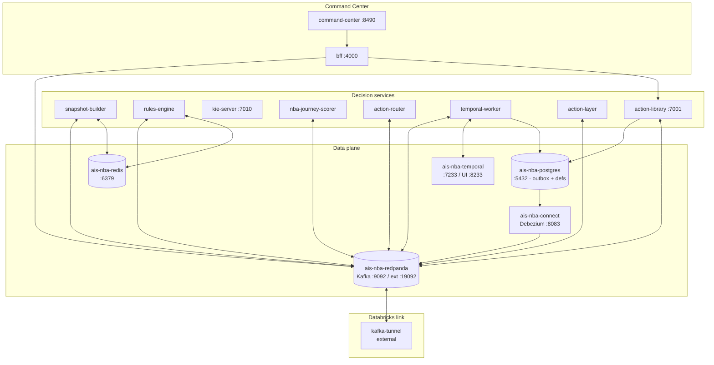
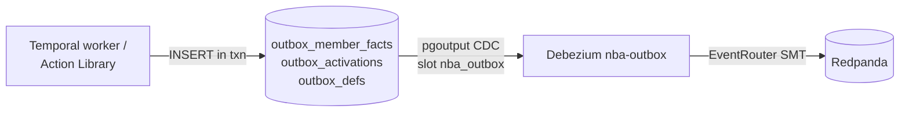

# 09 · Infrastructure

Everything runs as Podman containers on the `aiservices_default` bridge network, `--restart unless-stopped`, addressing each other by DNS alias (`nba-redpanda:9092`, `nba-redis:6379`, …). Per-container run scripts live in `nba/infra/run-nba-*.ps1` and `nba/services/*/run.ps1`.

## Container topology



## Containers

| Container | Image | Ports | Role |
|-----------|-------|-------|------|
| `ais-nba-redpanda` | `redpandadata/redpanda:v24.2.7` | 9092 (internal, anon), 19092 (ext SASL), 8081/8082 | Kafka broker. Isolated from `ais-cdc-redpanda`. `--smp=1 --memory=1G`. |
| `ais-nba-postgres` | `postgres:16-alpine` | 5432 | Action/rule defs + the 3 outbox tables. `wal_level=logical` for CDC. |
| `ais-nba-redis` | `redis:7-alpine` | 6379 | Snapshots, idmap, latches, suppression, rulefacts. 256MB, `noeviction`, AOF. |
| `ais-nba-temporal` | `temporalio/temporal` | 7233, 8233 | `server start-dev` (embedded DB — restart = fresh workflows, POC). `run-nba-temporal.ps1` re-registers the custom search attributes **`NbaActionId` / `NbaChannel`** on every boot (start-dev is in-memory, so they vanish on restart and a missing key silently fails every workflow start). |
| `ais-nba-connect` | `debezium/connect:2.7` | 8083 | Kafka Connect; runs the `nba-outbox` Debezium connector. EOS enabled. |
| `ais-nba-snapshot-builder` | local Java | — | Snapshot LWW. |
| `ais-nba-rules-engine` | local Java | — | Drools eligibility. |
| `ais-nba-kie-server` | local Java | 7010 | Optional Drools scale-out. |
| `ais-nba-journey-scorer` | local Python | — | Propensity (local stand-in: `nba.evaluations` → `nba.score.{action}.{channel}` facts; Databricks CQL model in prod). |
| `ais-nba-action-router` | local Java | — | Winning channel. |
| `ais-nba-temporal-worker` | local Java | — | State machine worker + bridges. |
| `ais-nba-action-layer` | local Java | — | One comm · dispositions. |
| `ais-nba-action-library` | local Java | 7001 | Authoring + inbound serve. |
| `ais-nba-bff` | `node:20-alpine` | 4000 | Command Center BFF. |
| `ais-nba-command-center` | nginx | 8490 | Command Center UI. |
| `ais-nba-inbound-sim` | `localhost/ais-nba-inbound-sim` | — | Local inbound-member client: reads warm members (a live `SOFT_COMPLETED` actionstate in their `nba:snapshot`) from nba-redis and drives the **real** inbound APIs on nba-action-library — serve (`GET /next-action`) → disposition (`POST /disposition`) → completion (`POST /completion`). On `aiservices_default`; reaches nba-redis + nba-action-library. |
| `ais-nba-kafka-tunnel` | localxpose | — | external TCP tunnel `<tunnel-endpoint>` → Redpanda external listener (Databricks). |

`ais-nba-datalake` is **retired** (comms counting moved to Databricks).

**`ais-nba-inbound-sim` env knobs** — `HARD_FRACTION` (≈0.4: soft-engage mostly, hard-complete sometimes),
`COLD_RATE` (≈0.015: a baseline of non-warm members spontaneously show up — warmth is a LIFT on inbound
completion, not a gate), `TOPIC_RATE` (≈0.3: fraction of visits carrying a "call topic" → facts → the serve
HOT-PATHS; the rest serve cached — bounds the gold reads), `NBA_SCORER` (`local` → in-network nba-model for the
sim's disposition scoring, robust under load). Inbound completions flow the **same** proven path every inbound
disposition does (outbox → `nba.member.facts` → snapshot-builder + datalake), so the lake carries
"soft-complete → inbound completion" and the model learns to surface that action inbound. (Replaces the old
shortcut that wrote a completion fact straight onto the bus; the Databricks source-sim now models OUTBOUND
response only — its `generate_inbound` direct-fact shortcut is removed.)

## The transactional outbox + CDC

The state machine and the Action Library never produce to Kafka directly. They INSERT into a Postgres outbox in the same transaction as the business write; Debezium turns each row into a Kafka message. This makes "update the DB and emit the event" atomic.



**EventRouter mapping** (`nba/infra/nba-outbox-connector.json`):
- `aggregatetype` → Kafka **topic**
- `aggregateid` → Kafka **key**
- `payload` → Kafka **value** (`null` → tombstone)
- `kind` → Kafka **header** `kind`

| Outbox table | Routes to |
|--------------|-----------|
| `outbox_member_facts` | `nba.member.facts` |
| `outbox_activations` | `nba.activations` |
| `outbox_defs` | `nba.definitions` or `nba.member.facts` (per row's `aggregatetype`) |

`exactly.once.support=required`; key/value converters are `StringConverter` (plain JSON text — no Avro/registry).

## Boot order

Boot waves are encoded as `--label ais.boot.wave=N`:

| Wave | Containers |
|------|-----------|
| 15 | redpanda, postgres, redis |
| 16 | temporal, kafka-tunnel, snapshot-builder, action-library, bff |
| 17 | rules-engine, nba-journey-scorer, command-center |
| 18 | nba-conversion-sim |
| 19 | action-router |
| 20 | temporal-worker |
| 21 | action-layer |
| 23 | connect (Debezium) |

After wave 15: run `nba/infra/create-topics.ps1` to provision all topics + DLQs. The scorer (17) before the router (19) gives scoring a head start; the router does nothing until scores arrive anyway.

## One-command bring-up

The whole stack boots from a single script — no manual wave-by-wave run scripts:

```powershell
pwsh nba/up.ps1 -Build    # first run: compiles every service image from source (~10-15 min)
pwsh nba/up.ps1           # later runs: reuse cached images (~2-3 min); every step is idempotent
pwsh nba/down.ps1         # tear down (add -Volumes to wipe data too)
```

`up.ps1` boots infra → topics → Temporal (registering `NbaActionId`/`NbaChannel`) → the app tier in dependency order, then seeds definitions + demo members and smoke-tests that facts flow through to snapshots/evaluations.

## Reference engines (KStreams + Flink, shadow)

Two **additive** reference engines accompany the classic spine, used by the load-test study (see [`../PERFORMANCE.md`](../PERFORMANCE.md)):

| Container | Engine | Role |
|-----------|--------|------|
| `ais-nba-decision-engine` | **Kafka Streams** | reimplements the **snapshot** stage on RocksDB state + an Interactive-Query read surface (`:7020`). |
| `ais-nba-flink-engine` | **Apache Flink** | reimplements the **whole spine** (snapshot → rules → score → route) plus the lifecycle **state machine that replaces Temporal**, as one job. |

Both default to **`-Mode shadow`**: they consume in their own groups, write `.shadow` topics, and **drive nothing** — so they run safely alongside the classic services for diffing + throughput measurement. Bring them up with the classic stack via:

```powershell
pwsh nba/up.ps1 -Engines    # also starts decision-engine + flink-engine in shadow
```

(`-Mode authoritative` is the cutover path — emits the real topics + Redis write-through — and is out of scope for the shadow load tests.)

## Networking & external link

- All in-network traffic is anonymous on Redpanda's internal listener (`:9092`).
- The **external listener** (`:19092`, SASL/SCRAM) is exposed to Databricks Serverless via the external TCP tunnel at the reserved endpoint `<tunnel-endpoint>`. A companion pandaproxy tunnel exposes the REST proxy at `<proxy-tunnel-endpoint>` (key-auth).
- The Command Center UI's nginx proxies `/graphql`, `/topology`, `/recent`, `/livestats`, `/stream` to `nba-bff:4000` (Podman DNS resolver `10.89.0.1`, `valid=30s` so BFF restarts re-resolve).

## Build & deploy

Each service has a `run.ps1` (Podman build + run on `aiservices_default`). The Command Center: `bff/run.ps1 -Build` rebuilds the BFF image; `ui/run.ps1 -Build` rebuilds the nginx image (which runs the Vite build). Java services build a Gradle shadow fat-jar into an `eclipse-temurin:21-jre` image. The recreate flow follows the DAS doctrine: rebuild image → `podman rm -f` → `podman run` from the committed run script.

## Action-library feature read (gold-direct)

The action-library hot path reads the ~30 rich model features (riskScore, comorbidityCount, rxAdherencePDC,
openCareGaps, the activity/clinical/profile block) **straight from gold** (`{LAKE_NS}.gold_member_snapshot`) via
the serverless SQL warehouse — `goldFeatures(entityId)`, `featureSource="gold"`, ~1s warm (the hot path wears the
latency). The old `nba:features` Redis cache machinery is **GONE** (`warmFeatures`, the `/warm-features` prefetch
endpoint + route, `FEATURE_TTL`). The Redis caches are now exactly **three**: snapshot, eligibility, action→fact
(catalog/rules).

`run.ps1` therefore wires two new env vars into the action-library:
- `NBA_DBX_WAREHOUSE` — the serverless SQL warehouse id (`<warehouse-id>`) for the gold feature read.
- `NBA_LAKE_NS` — the gold catalog/schema namespace.

> A `lakebaseFeatures` point-read (~ms, by `nbaId` against a continuously-synced Lakebase table) is left
> **dormant** in the action-library for when the UC-metastore storage-root blocker clears; see
> [08-data-and-lake.md](08-data-and-lake.md).

## Persistence & restart semantics

| Store | Survives restart? |
|-------|-------------------|
| Redpanda topics (compacted) | Yes (volume `ais-nba-redpanda-data`). |
| Postgres defs + outbox | Yes (volume). |
| Redis snapshots/latches | Yes (AOF). |
| Temporal workflows | **No** — `start-dev` is in-memory (POC). A restart loses in-flight workflows; the compacted topics + Redis let the pipeline re-derive state on the next fact. |

Production would run Temporal with a persistent datastore. The rest of the stack is already durable.

## Operational notes

- **Recreating live shared containers** reverts other work — commit code and let the proper deploy recreate.
- **n8n / vault doctrine** does not apply to the NBA stack (it is self-contained Podman), but the same "edit run-script, recreate from script" discipline holds.
- **Databricks cost**: the warehouse is the only cloud-billed surface; stop the BFF + run `shutdown_minimal.py` to idle it (see [08-data-and-lake.md](08-data-and-lake.md#cost-control)).
- **Databricks parked (minimum spend)**: as of this session all Databricks compute is parked — SQL warehouse **STOPPED**, Lakebase instance **STOPPED** (parked, data kept), custom serving endpoints (`nba-cql`, `nba-propensity`) **DELETED**, retrain schedules (`nba-ml-rl-retrain`, `nba-ml-retrain-loop`) **PAUSED**, source-sim run cancelled. Foundation-model APIs (`databricks-*`) are left (pay-per-token, no idle cost). **To resume:** un-park Lakebase → run `nba-ml-rl-serve` (re-creates `nba-cql` + the `@champion` alias) → un-pause the retrains; the warehouse auto-starts on the first gold query.
