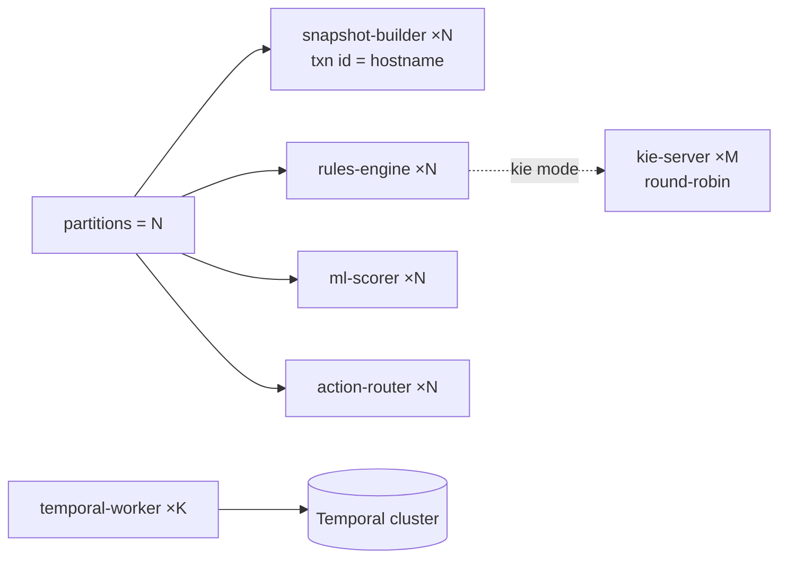

# 10 · Scaling & Throughput

This document describes the system's **scaling model** and its **predicted throughput and latency properties**, derived from the architecture (not a load-test report). Where a number is an estimate it is labeled as such.

## The partitioning model

Today every topic is **1 partition / 1 replica** (a PoC default). The system is, however, **partition-ready by construction** — the keys are already chosen so that adding partitions requires no code change, only `rpk topic add-partitions` + launching more instances.

| Topic | Key | Co-location guarantee |
|-------|-----|----------------------|
| `nba.facts`, `nba.member.facts` | `entityType:entityId` | All of a member's facts land on one partition → one snapshot-builder owns a member. |
| `nba.snapshots`, `nba.evaluations` | `nbaId` | One member's snapshots/evals are ordered on one partition → one rules/scorer/router instance. |
| `nba.activations` | `nbaId:actionId:channel:sm` | Per ChannelAction. |

Because a member is the unit of locality, **per-member ordering is preserved at any partition count** — this is the property that makes scale-out safe.

## How each stage scales

| Service | Scale unit | Notes |
|---------|-----------|-------|
| **snapshot-builder** | 1 per `member.facts` partition | Each instance gets a unique transactional id via `$HOSTNAME`. The `SETNX` id-map mint is race-safe across instances. |
| **rules-engine** | 1 per `snapshots` partition | Embedded mode creates a `KieSession` per snapshot. For heavier rule sets, switch `NBA_RULES_MODE=kie` and scale the stateless **kie-server** to M replicas behind one DNS alias — the rules-engine offloads evaluation over HTTP. |
| **ml-scorer** | 1 per `evaluations` partition | The feature-store consumer is manual-assign (each instance keeps its own in-memory `FEATURES` from the compacted `nba.facts`). RAM scales with member×fact cardinality. |
| **action-router** | 1 per `evaluations` partition | In-memory suppression set; stateless otherwise. |
| **temporal-worker** | K workers on one task queue | Workflow count scales with the Temporal cluster, not the worker count; workers are stateless executors. |
| **action-layer** | 1 per `activations` partition (PoC) | The `WALKS` map is in-memory; production replaces the simulator with provider webhooks (stateless) and the map disappears. |
| **action-library** | N stateless HTTP replicas | Postgres-backed; each replays the compacted `nba.definitions` to converge its in-memory suppression set. |
| **Databricks lake** | serverless autoscale | Independent of the Kafka stack; scales with data volume. |

## Predicted throughput

The hot path is `member.facts → snapshot → eval → score → route`. Bounds, per stage (single instance, single partition — estimates):

| Stage | Cost per item | Estimated single-instance throughput | Bottleneck |
|-------|---------------|--------------------------------------|-----------|
| snapshot-builder | batched poll + pipelined Redis HGET/HSET + 1 Kafka txn per batch | **~5–15k facts/s** (batches amortize the txn) | Redis round-trips + Kafka txn commit |
| rules-engine (embedded) | 1 `KieSession` build/fire/dispose per snapshot | **~1–3k snapshots/s** (rule-count dependent) | Drools session lifecycle |
| rules-engine (kie mode) | HTTP per snapshot, M kie-servers | scales ~linearly with M | network + kie-server CPU |
| ml-scorer | in-memory map lookups + arithmetic | **~10–30k evals/s** | trivial; bound by Kafka consume |
| action-router | flag reads + 1 Redis `hget` | **~10–20k evals/s** | Redis maxbatch read (cached default) |
| temporal-worker bridge | header filter (no deserialize) + workflow signal/start | **~hundreds–low-thousands starts/s** per Temporal cluster | Temporal persistence |

These multiply with partition count. The realistic ceiling at meaningful scale is **Temporal workflow start/signal rate** and **Redis** — both horizontally scalable (Temporal cluster sizing; Redis Cluster / per-shard snapshot keys).

> The numbers above are architectural estimates for capacity planning, not measured benchmarks. The live Command Center shows *actual* per-stage throughput (events/s) and per-hop processing latency in real time — that is the source of truth for a given deployment.

## Predicted latency

| Hop | Typical (warm pipeline) | Notes |
|-----|-------------------------|-------|
| fact → snapshot | **single-digit ms** | batched poll; Redis-bound |
| snapshot → eval | **tens of ms** | Drools fire |
| eval → score | replay-safe ts ⇒ not measurable from facts | sub-ms compute |
| eval → route | **tens of ms** | flag reads |
| route → **send** | **= debounce window (60s prod)** | *intentional* — the burst settles into one decision |
| send → disposition | seconds–minutes | provider-dependent |
| disposition → conversion | minutes–days | recirculates |

The **debounce window dominates end-to-end "decision to send" latency by design** — it is the dedup/settling period, not a performance problem. Lowering it (e.g. to 5–10s) makes demos snappier at the cost of more sibling churn; the production value is 60s.

The lake's medallion ingestion adds **its own visible latency** (the `availableNow` drain interval, default 20s in continuous mode) on the `source → lake → member.facts` hop. The System Map surfaces this as the lake node's processing latency.

## Bottlenecks & mitigations

| Bottleneck | Signal | Mitigation |
|-----------|--------|-----------|
| Redis hot keys (snapshots) | snapshot-builder latency rising | shard snapshots across Redis Cluster (keys already per-`nbaId`); raise partitions for parallel owners |
| Drools session churn | rules-engine latency rising | `NBA_RULES_MODE=kie` + scale kie-server; reduce rule count via `factsUsed` pruning |
| ml feature-store RAM | ml-scorer memory | bound `nba.facts` cardinality (lean filter already helps); shard by partition |
| Temporal start rate | bridge backlog | scale Temporal cluster; raise `activations` partitions |
| Debounce visibility lag | duplicate sends under extreme burst | the eventual-consistency window is immaterial at 60s; raise the window or add recheck rounds |
| Lake warehouse cost | warehouse running idle | stop the BFF + `shutdown_minimal.py` |

## Backpressure & durability under load

- **Compacted topics** absorb bursts and let any consumer rebuild current state from `earliest` on restart.
- **Exactly-once** at the snapshot-builder (Kafka txn) + **idempotent** downstream (event-time LWW, eval-hash dedup, Temporal workflow-id dedup) mean a slow consumer never corrupts state — it just lags, then catches up.
- **DLQs** isolate poison records so one bad message never blocks a partition; replay is safe (idempotent everywhere).
- The **state machine is the natural backpressure valve**: the debounce window and the throttle gate hold sends back under bursty input, so a fact storm produces *one* well-chosen send per member per channel, not a storm of sends.

## Capacity planning rule of thumb

For a target of **X members each generating F fact-updates/sec**:
- partitions ≈ `ceil(X·F / 10_000)` (snapshot-builder ceiling), and run that many of each pipeline stage;
- Temporal cluster sized for the **send rate** (a tiny fraction of F — most facts don't trigger a send thanks to dedup + eligibility);
- Redis memory ≈ `X · (rulefacts + active ChannelActions) · ~200 bytes`;
- the lake autoscales with raw volume independently.

The decisioning pipeline is cheap; the durable send lifecycle (Temporal) and the snapshot store (Redis) are where you provision for scale.
