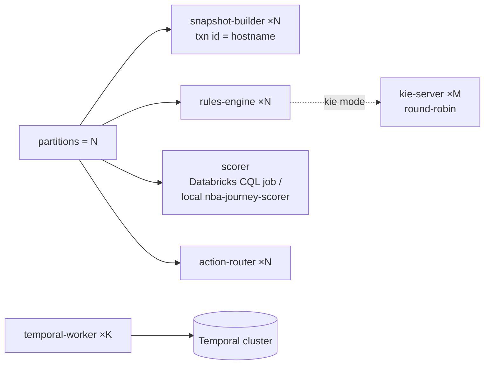

# 10 · Scaling & Throughput

This document describes the system's **scaling model** and its **measured throughput and latency properties**. A real load-test study now exists — see [`../PERFORMANCE.md`](../PERFORMANCE.md) for the consolidated, decision-oriented summary and [`../infra/loadtest-results.md`](../infra/loadtest-results.md) for the raw runs, methodology, and gotchas. The per-stage figures below are **per-instance / single-partition** (one pod, one Kafka partition); horizontal scale (partitions × pods) is structural and multiplies them.

## The partitioning model

Today every topic is **1 partition / 1 replica** (a PoC default). The system is, however, **partition-ready by construction** — the keys are already chosen so that adding partitions requires no code change, only `rpk topic add-partitions` + launching more instances.

| Topic | Key | Co-location guarantee |
|-------|-----|----------------------|
| `nba.facts`, `nba.member.facts` | `entityType:entityId` | All of a member's facts land on one partition → one snapshot-builder owns a member. |
| `nba.snapshots`, `nba.evaluations` | `nbaId` | One member's snapshots/evals are ordered on one partition → one rules/scorer/router instance. |
| `nba.activations` | `nbaId:actionId:channel:sm` | Per ChannelAction. |

Because a member is the unit of locality, **per-member ordering is preserved at any partition count** — this is the property that makes scale-out safe.

## Three reference architectures (load-tested)

The load-test study profiled the spine three ways. All three share the same Kafka topology and member-keying; they differ in **where member state lives** and **what replaces Temporal**. See [`../PERFORMANCE.md`](../PERFORMANCE.md) for the full comparison.

| Architecture | What it is | State store | State machine |
|--------------|-----------|-------------|---------------|
| **classic** | the default (`up.ps1`) — Redis snapshot + Drools rules + scorer + router + Temporal | central **Redis** | **Temporal** |
| **KStreams** (`nba-decision-engine`) | reimplements only the **snapshot** stage on RocksDB + an Interactive-Query read surface; rules/router/Temporal unchanged | **RocksDB** (per partition) | Temporal (unchanged) |
| **Flink** (`nba-flink-engine`) | reimplements the **whole spine** (snapshot → rules → score → route) **plus the lifecycle state machine that replaces Temporal**, as one job | **Flink keyed state** | **Flink state machine** (ThrottleGate + member-keyed dedup ported) |

The reference engines run **additively in shadow** alongside classic (`pwsh nba/up.ps1 -Engines`) — they consume in their own groups, write `.shadow` topics, and drive nothing.

**The hybrid bottom line.** Classic stays the right call until **member-state exceeds economical RAM**, **one Redis saturates on write QPS**, or **the daily ~8M-score bulk burst can't drain in time** (~40–53 min of serial backlog on a single classic pod, blocking live facts, vs **minutes** partitioned across slots/pods). At that crossover the shape is: **disk-backed partitioned compute** (KStreams/Flink) to absorb the burst and scale state past RAM + a **sharded / TTL'd Redis read cache** kept as the fast, always-up hot-path read surface + **Temporal scaled out** for the daily action-dispatch spike.

## How each stage scales

| Service | Scale unit | Notes |
|---------|-----------|-------|
| **snapshot-builder** | 1 per `member.facts` partition | Each instance gets a unique transactional id via `$HOSTNAME`. The `SETNX` id-map mint is race-safe across instances. |
| **rules-engine** | 1 per `snapshots` partition | Embedded mode creates a `KieSession` per snapshot. For heavier rule sets, switch `NBA_RULES_MODE=kie` and scale the stateless **kie-server** to M replicas behind one DNS alias — the rules-engine offloads evaluation over HTTP. |
| **scorer** | serverless / 1 per `evaluations` partition | The standalone `ml-scorer` service is **retired**. Scoring is the **Databricks CQL job** (serverless autoscale) or, in the local loop, the **`nba-journey-scorer`** stand-in (1 per `evaluations` partition). |
| **action-router** | 1 per `evaluations` partition | In-memory suppression set; stateless otherwise. |
| **temporal-worker** | K workers on one task queue | Workflow count scales with the Temporal cluster, not the worker count; workers are stateless executors. |
| **action-layer** | 1 per `activations` partition (PoC) | The `WALKS` map is in-memory; production replaces the simulator with provider webhooks (stateless) and the map disappears. |
| **action-library** | N stateless HTTP replicas | Postgres-backed; each replays the compacted `nba.definitions` to converge its in-memory suppression set. |
| **Databricks lake** | serverless autoscale | Independent of the Kafka stack; scales with data volume. |

## Measured throughput (June 2026 load-test study)

The hot path is `member.facts → snapshot → eval → score → route`. The numbers below are **measured** (per-instance, single partition, on the dev box — a 32 GB / 24-core podman VM — with the safety constraints lifted so each layer runs unthrottled). Engine columns are **shadow mode / Redis write-through OFF** unless noted. Raw runs in [`../infra/loadtest-results.md`](../infra/loadtest-results.md).

| Stage | classic (Redis) | KStreams (RocksDB) | Flink (heap state) | Bottleneck |
|-------|-----------------|--------------------|--------------------|-----------|
| snapshot build | **2,561/s** | **6,951/s** | **≥20,000/s** | classic: Redis `HSET` network RTT; KStreams: RocksDB local disk; Flink: heap, write-through OFF |
| rules eval (embedded Drools) | **3,326/s** | — *(engine = snapshot only)* | **20,709/s** | classic: one `KieSession`/eval; Flink: in-JVM condition-tree flatMap |
| action router | **3,455/s** | — | **~20k** | trivial per-record flatMap |
| temporal-worker bridge (state machine) | **15 → ~180/s** (see below) | — | runs (Flink state machine; not Kafka-lag-measurable) | the "12/15/s" was a serial-client artifact, **not** a rate limit |

**Reading.** The classic spine is **uniform at ~2.5–3.5k/s/instance** — the limit is the JVM consumer + per-record work + Redis round-trip, the same at every stage. Flink's stateless transforms are ~6× because they swap a `KieSession`-per-eval for an in-JVM condition-tree on heap state; KStreams reimplements only the snapshot stage by design, hence its one filled cell.

**On the Temporal "12/s".** That figure was a **serial-client artifact**: the bridge issued **blocking** `WorkflowClient.start` calls one at a time on a single consumer thread (~70 ms gRPC each → ~12–15/s), regardless of Temporal's capacity. Parallelizing the start path via `NBA_BRIDGE_CONCURRENCY` lifts it to **~180/s on the same single-node `start-dev` dev server**, where it **plateaus** — worker CPU idle, Temporal-server ~2 cores, **zero `RESOURCE_EXHAUSTED`**. So ~180/s is the single-node server floor, not a configured RPS limit or a throttle; it scales out in prod (history shards + real persistence).

These multiply with partition count. The realistic ceiling at meaningful scale is the **Redis RAM wall**, the **Temporal start path**, and the **write-through read-cache tax** — see the next subsection.

> The numbers above are the measured load-test figures for capacity planning. The live Command Center shows *actual* per-stage throughput (events/s) and per-hop processing latency in real time — that is the source of truth for a given deployment.

## The three things that actually bound the system

The compute stages are *not* the limiter. Three things are (full detail in [`../PERFORMANCE.md`](../PERFORMANCE.md) §3):

1. **The Redis RAM wall.** Under sustained load the central Redis (`maxmemory 256 MB`, `noeviction`) **filled at ~55k members (~4.6 KB/member) and rejected ALL writes** (`OOM command not allowed`) — a system-wide write failure (it also took the KStreams engine down via its one remaining Redis dependency, the idmap `setnx`). Disk-backed **RocksDB / Flink state has no such wall** (the engine recovered its local state in ~4 s after a crash).
2. **The Temporal start rate.** The "12/s" serial-client artifact → **~180/s parallel**, single-node server-bound (above).
3. **Write-through cost / the read surface.** Flink's ~20k is **write-through OFF** (local compute, no Redis write). Turn the Redis read cache **ON** and a single instance does the same per-record `redis.hset` as classic, so it converges back to the **~2.5–3k/s Redis-write bound**. Redis *must* stay the hot-path read cache because the KStreams Interactive-Query read surface **fails under load** (100% HTTP 500 during rebalance/recovery; single-threaded `com.sun` HttpServer that degrades 3.5× by C=10). So the disk-backed engines' real edge *with* the cache is **parallelism (N slots/pods × ~3k) + sharded Redis + shedding the state RAM-wall**, not single-slot speed.

## Predicted latency

| Hop | Typical (warm pipeline) | Notes |
|-----|-------------------------|-------|
| fact → snapshot | **single-digit ms** | batched poll; Redis-bound |
| snapshot → eval | **tens of ms** | Drools fire |
| eval → score | replay-safe ts ⇒ not measurable from facts | sub-ms compute |
| eval → route | **tens of ms** | flag reads |
| route → **send** | **= debounce window (60s prod)** | *intentional* — the burst settles into one decision |
| send → disposition | seconds–minutes | provider-dependent |
| disposition → conversion | minutes–days | recirculates |

The **debounce window dominates end-to-end "decision to send" latency by design** — it is the dedup/settling period, not a performance problem. Lowering it (e.g. to 5–10s) makes demos snappier at the cost of more sibling churn; the production value is 60s.

The lake's medallion ingestion adds **its own visible latency** (the `availableNow` drain interval, default 20s in continuous mode) on the `source → lake → member.facts` hop. The System Map surfaces this as the lake node's processing latency.

## Bottlenecks & mitigations

| Bottleneck | Signal | Mitigation |
|-----------|--------|-----------|
| Redis RAM wall (the measured ceiling) | writes start failing `OOM command not allowed` — central Redis filled at **~55k members / 256 MB / `noeviction`**, a system-wide write failure | shard snapshots across Redis Cluster (keys already per-`nbaId`) + TTL to hot members; or move state onto the **disk-backed engines** (KStreams RocksDB / Flink), which shed the wall entirely |
| Redis hot keys (snapshots) | snapshot-builder latency rising | shard snapshots across Redis Cluster (keys already per-`nbaId`); raise partitions for parallel owners |
| Drools session churn | rules-engine latency rising | `NBA_RULES_MODE=kie` + scale kie-server; reduce rule count via `factsUsed` pruning |
| Temporal start rate | bridge backlog | parallelize the start path (`NBA_BRIDGE_CONCURRENCY` — lifts the measured serial ~15/s to ~180/s on the dev box); then scale Temporal out (history shards + real persistence) and raise `activations` partitions |
| Debounce visibility lag | duplicate sends under extreme burst | the eventual-consistency window is immaterial at 60s; raise the window or add recheck rounds |
| Lake warehouse cost | warehouse running idle | stop the BFF + `shutdown_minimal.py` |

## Backpressure & durability under load

- **Compacted topics** absorb bursts and let any consumer rebuild current state from `earliest` on restart.
- **Exactly-once** at the snapshot-builder (Kafka txn) + **idempotent** downstream (event-time LWW, eval-hash dedup, Temporal workflow-id dedup) mean a slow consumer never corrupts state — it just lags, then catches up.
- **DLQs** isolate poison records so one bad message never blocks a partition; replay is safe (idempotent everywhere).
- The **state machine is the natural backpressure valve**: the debounce window and the throttle gate hold sends back under bursty input, so a fact storm produces *one* well-chosen send per member per channel, not a storm of sends.

## Capacity planning rule of thumb

For a target of **X members each generating F fact-updates/sec**:
- partitions ≈ `ceil(X·F / 2_500)` — the **measured** classic snapshot-builder ceiling is ~2,500–3,000 facts/s/instance (Redis-`HSET`-bound), so size off ~2,500 — and run that many of each pipeline stage. Disk-backed engines (KStreams ~7k, Flink ~20k local-compute) raise this, but turning the Redis read cache on (write-through) converges them back toward the same ~2.5–3k/s Redis-write bound, so the per-instance write rate, not the compute, sets the partition count;
- Temporal cluster sized for the **send rate** (a tiny fraction of F — most facts don't trigger a send thanks to dedup + eligibility);
- Redis memory ≈ `X · (rulefacts + active ChannelActions) · ~200 bytes`;
- the lake autoscales with raw volume independently.

The decisioning pipeline is cheap; the durable send lifecycle (Temporal) and the snapshot store (Redis) are where you provision for scale.
